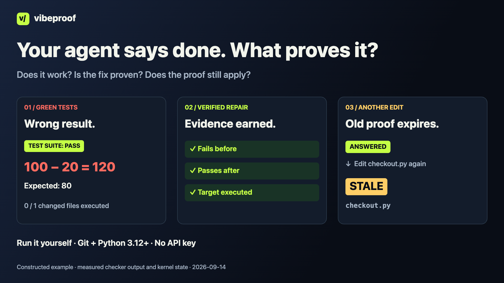

**English** · [简体中文](README.zh-CN.md) · [繁體中文](README.zh-TW.md)

# vibeproof

### Your coding agent says “done”. See what was actually checked.

You asked for a working change. The agent gave you a green test run. Did that run even touch the code it changed?

vibeproof adds executable checks to Claude Code and Codex tasks and keeps the results tied to the code they examined. Start with a deliberately broken discount calculation: **100 − 20 returns 120, yet the tests pass.**

**Claude Code and Codex adapters for git repos. Best first fit: a Python project with an existing test suite.** The dual-host path is validated on macOS; host setup, trust and coverage limits are in [CODEX.md](docs/CODEX.md).



[Watch the narrated demo](docs/launch/assets/v4/demo-en.mp4) · [Try it locally](#try-it-locally) · [Use it in your repo](docs/GETTING_STARTED.md)

The video was recorded for the 2026-09-05 demo baseline. Run the command below to verify the current checkout.

## Three familiar problems

| What happened | What vibeproof adds |
|---|---|
| “All tests pass”, but the new behavior was never tested | Runs your suite; for eligible Python changes, flags when the run executed none of the changed files |
| Tests disappeared during a “refactor” | Compares live-test counts against the starting commit and reports decreases |
| “Just fix this” turns into edits elsewhere | Claude Write/Edit and Codex apply_patch hooks check the task's allowed paths |

These checks have limits. A file being imported is not a behavior test. A test-count check does not establish assertion quality. Test deletion is report-only by default, and hooks are not a security boundary. [Read the exact limits](docs/REFERENCE.md).

## Try it locally

You need **Git and Python 3.12+**. Use macOS or Linux; native Windows is not validated. This demo needs no packages, API key or coding-agent subscription.

```sh
git clone https://github.com/howardc38/vibeproof.git
cd vibeproof
python3 examples/first-proof/run.py
```

The demo builds a temporary repo and runs real checkers. It does not install the framework into your project. After cloning, it runs offline.

A 20-unit discount on a 100-unit cart should leave **80**. The deliberately wrong edit returns **120**, while an unrelated test stays green. vibeproof reports:

```text
the suite passed and executed none of the 1 changed file(s):
  checkout.py
```

Then a real regression test fails, the implementation is repaired, and the review checker verifies three things: **the test fails before the fix, passes after it, and executes the target function**. The demo also runs negative controls that show what the checks cannot prove.

**Expected FAIL output is part of the demo.** Success ends with `DEMO VERIFIED`. This is a constructed example with real command output, not a captured AI conversation or a full `ship` run. [Inspect the source and transcript](examples/first-proof/README.md).

## Why use the framework beyond one check?

| The next problem | How the workflow helps |
|---|---|
| The agent edits again after a PASS | Relevant input changes make old evidence stale, so that answer cannot keep counting as a current pass |
| A reviewer says “fixed” without a useful regression test | A typed review finding can require the same test to fail before, pass after, and execute the target function |
| A warning should not stop today's task, but should not disappear | Report-only findings and attempts stay in the ledger; ship policy determines whether they hold the task |

These are reasons to try the combination, not claims that no other tool offers similar features. Your existing tests still decide what correct behavior means.

## What is included, and how does it work?

vibeproof connects a task's checks, review findings and current evidence in one workflow:

```text
Request + scope → task
                  ├─ detectors → claims
                  └─ lenses + reviewer → review findings
Claims → engagement where required → checkers → recorded attempts
Current claim states + policy → HELD, or SHIP with remaining reports
```

**Claims and checker attempts go into the ledger whether they block ship or only report.** Gate mode decides what holds the task; it does not decide whether the finding is remembered.

| Included | What you get |
|---|---|
| Workflow helpers | Claude agent/command templates plus generated Codex roles and skills for run, sweep, wave and maintain |
| Hooks | Earlier checks on supported writes, shell commands and stopping; scope is also checked against the resulting diff |
| Detectors → checkers | Programs raise applicable questions; separate programs execute checks and record their results |
| Review lenses | Structured review of design fit, request fidelity, test sufficiency and other areas beyond mechanical patterns |
| Ledger + evidence lifetime | Open questions, attempts and decisions stay attributable to tasks; relevant input changes invalidate old answers |
| Ship policy | Some kinds block immediately; others remain visible reports and can escalate at configured thresholds during task evaluation |
| Runtime / UI proof | Runs the real trigger, truth query or UI suite that your repo declares |
| Checker registration | Exercises red/green/bypass fixtures and repeatability before a checker is accepted into the registry |

Agent/command files and lenses guide behavior; their presence does not prove an agent followed them. A review finding without an explicit task goes to the standing `repo-review` task and does not automatically block another task's ship.

Existing coverage, test-locking and scope tools can solve individual checks. The reason to consider this framework is coordinating questions, reviews and still-valid evidence across a task's edits. [Full feature and command catalog](docs/FEATURES.md) · [Code-grounded comparison](docs/launch/POSITIONING.zh-TW.md)

## Use it in your repo

[Follow the adoption guide →](docs/GETTING_STARTED.md)

Your agent can run the lifecycle commands. You provide the requested outcome, allowed files, real test command and decisions about unresolved risks. The guide includes a pasteable agent prompt and preserves existing Claude settings when connecting hooks.

Full installation adds checkers, detectors, fixtures, hooks and prompts to your repo and runs fixture checks. It takes longer than the standalone demo. It also asks you to confirm facts about external writes and auth; it is not a one-click guarantee.

The working loop is:

```text
Request + allowed files → derive checks → edit + test → inspect results → ship decision
```

An old pass becomes stale when relevant code or checking inputs change. `SHIP` is the framework's configured decision, not a deployment command or a guarantee that every requirement was met.

## What else can it check?

Selected swallowed-error and external-write patterns; committed credential patterns; changed call signatures and dangling references; and configured UI/runtime proofs. The exact coverage depends on your language, declared facts and test environment. [Technical reference](docs/REFERENCE.md)

| Area | Current support |
|---|---|
| Automatic hooks | Claude Code and Codex; see [host setup](docs/CODEX.md) |
| Ordinary suite execution tracing | Python; file-level, not complete branch or assertion coverage |
| Review repair proof | Python, Go and Node/V8 paths; runner-dependent |
| Structural checks | Python, Go and TS/JS to different depths; limited Rust support |

## Before relying on it

- Hooks can stand down when state is unavailable. The stop hook interrupts once, then permits another stop.
- Some findings report without immediately holding ship. Accepted risks are possible, including agent signatures.
- Local ledger records and hashes are useful evidence; they are not an immutable external trust service.
- Business correctness, security and good design still require suitable tests and human judgment.

[All limits and exit codes](docs/REFERENCE.md) · [Full workflow](docs/USING.md) · [Facts format](docs/FACTS.md)

## Help make the second task easier

Try one small real change, then [tell us what happened](https://github.com/howardc38/vibeproof/issues/new?template=first-run.yml): what it caught, what it got wrong, and whether you would keep it enabled. Sanitized logs are welcome; private code and credentials are not needed.

To run the framework's own tests:

```sh
python3 tests/run_without_silent_skips.py
```

Maintaining vibeproof itself? Work in the canonical development repository; see [contributing](CONTRIBUTING.md) and [release synchronization](docs/SYNC.md).

MIT licensed. [License](LICENSE) · [Implementation specification](docs/SPEC.md)
