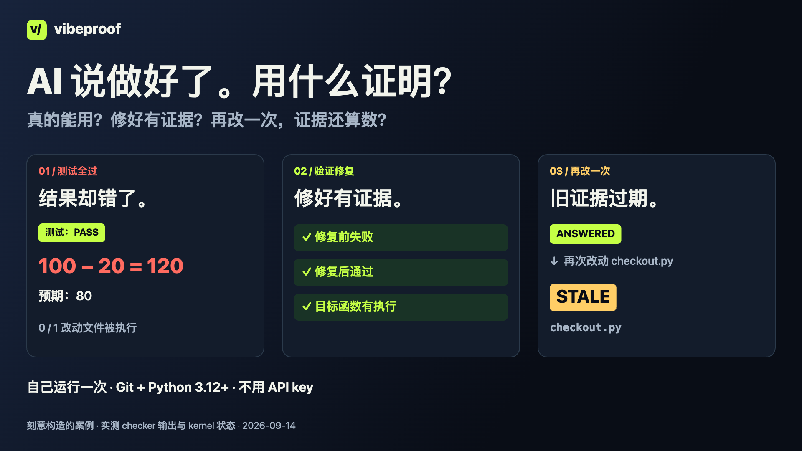

[English](README.md) · **简体中文** · [繁體中文](README.zh-TW.md)

# vibeproof

### AI 说做好了。看看它实际检查过什么。

你要的是能用的改动，AI 给你的是“测试全过”。但那些测试，真的碰过它刚改的代码吗？

vibeproof 把可执行的检查接进 Claude Code 和 Codex 任务，让每次结果对应它当时检查过的代码。先看一个故意写错的折扣例子：**100 − 20 算出 120，测试却全过。**

**支持 Claude Code 和 Codex 的 git 项目。最容易上手：已经有测试的 Python 项目。** 双宿主流程在 macOS 验证；配置、信任与覆盖限制见 [CODEX.md](docs/CODEX.md)。



[看普通话配音演示](docs/launch/assets/v4/demo-zh-CN.mp4) · [自己运行一次](#自己运行一次) · [用在你的项目](docs/GETTING_STARTED.zh-CN.md)

视频记录的是 2026-09-05 演示基准。运行下方命令可验证当前 checkout。

## 这三件事，你遇到过吗？

| 发生了什么 | vibeproof 帮你检查什么 |
|---|---|
| AI 说测试全过，但新功能根本没被测到 | 运行你的测试；对符合条件的 Python 改动，指出整个运行过程都没触及任何改动文件的情况 |
| AI“重构”时，把测试删了 | 与起始 commit 比较有效测试数量，报告减少的情况 |
| 只让它修一件事，却改了其他地方 | Claude Write/Edit 和 Codex apply_patch hooks 会检查任务允许修改的路径 |

这些检查有范围：import 过文件不等于测过功能；测试数量不代表断言质量；删测试默认只会报告；hook 也不是无法绕过的安全边界。[查看完整限制](docs/REFERENCE.md)。

## 自己运行一次

需要 **Git 和 Python 3.12+**，使用 macOS 或 Linux；尚未验证原生 Windows。演示不用安装软件包、不用 API key，也不用订阅 coding agent。

```sh
git clone https://github.com/howardc38/vibeproof.git
cd vibeproof
python3 examples/first-proof/run.py
```

脚本会创建临时 repo，运行真正的 checker，完成后清理临时 repo。它不会把 framework 安装到你的项目里；clone 完即可离线运行。

100 元减去 20 元折扣，应该是 **80**。演示故意写错成 **120**，一条无关的测试却仍然全绿。vibeproof 会指出：

```text
the suite passed and executed none of the 1 changed file(s):
  checkout.py
```

接着加入真正测到问题的测试，先看到它失败，再修正代码。review checker 会验证：**同一条测试修正前失败、修正后通过，而且执行过目标函数。** 演示也会运行反例，让你看到检查的限制。

**过程中出现 FAIL 是预期的。** 最后显示 `DEMO VERIFIED` 才代表演示完整通过。这是刻意构造的案例，命令及输出都是真实运行；不是录制的 AI 对话，也没有展示完整 `ship` 流程。[看源代码与执行记录](examples/first-proof/README.md)。

## 除了单次检查，为什么用整套流程？

| 接下来的麻烦 | 流程怎样帮忙 |
|---|---|
| 刚刚 PASS，AI 又改了代码 | 相关输入一变，旧证据就会过期，不能继续当作当前已通过 |
| Reviewer 说修好了，却没有有用的回归测试 | 有类型的 review finding 可以要求同一条测试修正前失败、修正后通过，而且执行目标函数 |
| 一个警告不值得拦住今天的任务，但也不能忘掉 | 只报告的问题与执行记录仍留在 ledger；是否阻挡由 ship policy 判定 |

这些是值得试用整套组合的理由，不代表其他工具完全做不到。什么才算正确行为，仍需要你的测试定义。

## 包含哪些功能？怎样连在一起？

vibeproof 把一个任务的检查、review 发现与目前仍适用的证据接成同一个流程：

```text
要求与范围 → task
              ├─ detectors → claims
              └─ lenses + reviewer → review findings
claims → 必要的 engagement → checkers → 执行记录
当前 claim 状态 + policy → HELD，或 SHIP 并列出剩余报告
```

**会阻挡与只报告的 claims、checker 执行结果，都会记入 ledger。** Gate 模式决定什么会拦住任务，不是决定哪些问题才值得记住。

| 包含什么 | 对你有什么作用 |
|---|---|
| 流程助手 | Claude agents／commands，以及从同一来源生成的 Codex roles／skills，操作 run、sweep、wave、maintain 流程 |
| Hooks | 在支持的写入、shell 命令及停止时提前检查；也会再次检查最终 diff 的范围 |
| Detector → checker | 一部分程序提出适用的问题，另一部分实际执行检查、记录结果 |
| Review lenses | 提供设计适配、需求忠实度、测试充分性等 review 视角，补充机械模式之外的判断 |
| Ledger＋证据有效期 | 问题、尝试和决定有任务归属；相关输入改变时，旧答案会过期 |
| Ship policy | 有些类型立即阻挡，有些保留为可见报告；评估任务时可按阈值升级 |
| Runtime／UI 证明 | 运行项目声明的真实触发、数据查询或 UI 测试 |
| Checker 注册验证 | 用 red／green／bypass fixtures 和重跑一致性，检查要加入的 checker |

Agent／command 提示文件和 lenses 提供操作指引，不保证 agent 已遵守。没有指定 task 的 review finding 会进入常设 `repo-review`，不会自动阻止另一个任务交付。

Coverage、测试锁定、scope 工具也能处理单项检查。考虑这套 framework 的理由，是在任务反复修改时，一起跟踪待答问题、review 与仍然有效的证据。[完整功能与命令目录](docs/FEATURES.md) · [按 code 比较同类工具](docs/launch/POSITIONING.zh-TW.md)

## 用在你的项目

[从安装到第一个任务 →](docs/GETTING_STARTED.zh-CN.md)

agent 可以执行流程命令。你提供想要的结果、允许修改的文件、真正的测试命令，以及是否接受未解决风险的决定。指南附可粘贴给 agent 的指令，也说明如何保留现有 Claude 配置再加入 hooks。

完整安装会加入 checker、detector、fixtures、hooks 和提示文件，并先验证 fixtures，因此比短演示花更多时间。你也需要确认项目的外部写入和权限判断等事实；安装完成不代表代码已被全面验证。

```text
要求与修改范围 → 找出要检查的项目 → 修改与测试 → 查看结果 → ship 判定
```

相关代码或检查输入改变时，旧的通过结果会过期。`SHIP` 是 framework 按配置作出的判定，不会替你部署，也不保证每项需求都已满足。

## 支持范围

| 项目 | 目前能力 |
|---|---|
| 自动 hooks | Claude Code 和 Codex；见 [宿主配置](docs/CODEX.md) |
| 普通测试的改动执行追踪 | Python 文件级别；不是完整分支或断言覆盖 |
| 修正前后的 review 测试证据 | 有 Python、Go、Node/V8 路径；取决于 runner |
| 代码结构检查 | Python、Go、TS/JS 支持深度不同；Rust 较有限 |

另外可检查部分吞错、外部写入、凭证、调用接口及引用问题，并运行你配置的 UI／runtime 证明。实际覆盖取决于语言、事实表和环境。[技术参考](docs/REFERENCE.md)

## 使用前要知道

- hook 读不到必要状态时可能放行；Stop hook 只拦第一次。
- 部分问题默认只报告，不立即阻止 ship；风险可以被接受，包括由 agent 签署。
- 本地账本与 hash 有助留下证据，但不是不可修改的外部信任服务。
- 功能正确、安全性与设计质量，仍需要合适的测试和人的判断。

[完整限制](docs/REFERENCE.md) · [完整流程](docs/USING.md) · [事实表格式](docs/FACTS.md)

## 帮我们做到你愿意再用一次

试一个小任务后，[告诉我们结果](https://github.com/howardc38/vibeproof/issues/new?template=first-run.yml)：它发现了什么、误报了什么、哪一步最麻烦，以及下一个任务会不会继续用。只需分享去除敏感信息的记录，不需要私人代码或凭证。

运行 framework 自己的测试：

```sh
python3 tests/run_without_silent_skips.py
```

维护 vibeproof 本身时，请在 canonical 开发 repo 工作；见[贡献方式](CONTRIBUTING.md)与[同步流程](docs/SYNC.md)。

MIT 许可。[许可条款](LICENSE) · [实现规范](docs/SPEC.md)
