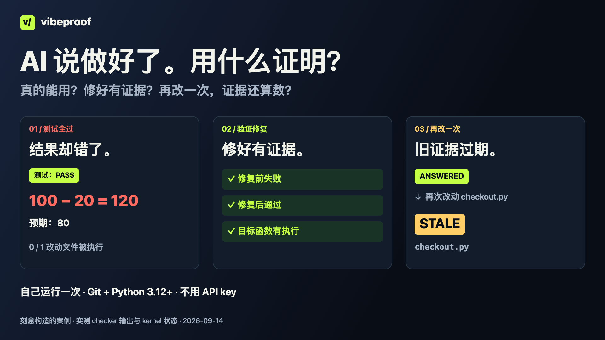

[English](README.md) · **简体中文** · [繁體中文](README.zh-TW.md)

# vibeproof

### 用 coding agent 开发，让工作有据可查。

vibeproof 是供 **Claude Code 和 Codex** 使用的开发工作流程。从有明确范围的需求开始，验证改动、整合并行任务，并在项目持续演进时跟踪审查与修复。

你能查看一份任务记录：允许改哪些文件、执行过哪些检查、修复有什么证据，以及哪些结果仍适用于当前的代码。根据这些结果，决定要接受哪些工作、哪些还需要处理。

[从项目的一项改动开始 →](docs/GETTING_STARTED.zh-CN.md) · [先运行独立演示](#自己运行一次) · [了解工作流程](#从需求到有据可查的工作)

## 什么时候值得试

- **开发功能或修复缺陷。** 让预期结果、允许改动的文件与验证记录，跟着 agent 的工作一起保留。
- **整合并行任务。** 在独立 Git worktrees 开发，整合后针对合并的代码重新检查。
- **持续维护项目。** 跟踪审查发现与已授权的修复，知道哪些审查尚未完成、哪些证据已经过期。

**最适合先试：** 已有真正 Python 测试的 Git 项目，你已经用 coding agent，也花不少时间检查它的工作。

## 从需求到有据可查的工作

1. **先说清楚任务范围。** 指定想要的结果与 agent 可以修改的文件，确认检查所需的项目事实，并要求 agent 逐项交代需求。这些记录方便你核对交付内容，本身不判定需求是否已满足。
2. **执行适用的检查。** 框架依任务范围找出适用的检查，记录结果。支持的编辑与停止 hooks 协助指出尚未处理的工作。任务政策区分会阻挡完成的问题，以及先报告、待处理的问题。
3. **拿出行为证据。** 执行项目真正使用的测试。审查发现的修复可连到一条测试：修正前失败、修正后通过，而且执行过目标。已配置的浏览器／UI 测试与运行时查询也可检查其他行为。断言是否有意义、项目如何配置，决定能证明什么。
4. **知道何时重新验证。** 先前的执行仍留在本地记录中；相关代码、配置或检查有所改动时，先前结果可能过期。审查记录与受检输入相连，让你区分完整、部分完成与已过期的审查。
5. **整合成果，继续跟踪。** Coding agent 的宿主协调 worktrees 中的任务，合并后重新验证。维护流程跟踪已授权的修复交接，可在相连的 worktree 重新检查修复，并读回原发现的状态。定期审查需要宿主调度器内真正存在的工作。
6. **按项目需要扩展检查。** 加入自定义规则，用 fixtures 验证。通过 `doctor` 检查接线，查看已声明风险的机制覆盖、趋势、已记录成本与导出记录。Monitor 审查检查框架判准与项目事实的改动；可选通知协助提醒处理。

宿主启动 agents 并调度定期工作。CLI 提供检查与已记录状态；审查判断与业务验收仍需要合适的测试及决定。Telegram 通知送达或确认已读，都不会关闭发现。

[完整功能地图](docs/FEATURES.md) · [维护操作](docs/USING.md#periodic-maintenance-and-findings) · [技术参考](docs/REFERENCE.md)

## 用在你的项目

[从安装到第一个任务 →](docs/GETTING_STARTED.zh-CN.md)

先在已经使用 agent 的项目中，选一项功能或修复。你提供想要的结果、允许修改的文件、真正的测试命令，以及未解决风险的决定。指南带你完成安装与第一个任务，并附上可粘贴给 agent 的指示。

完整安装会加入 checkers、detectors、fixtures、hooks 和提示文件，验证 fixtures，并要求确认项目事实，因此比短演示花更多时间。

**选择宿主：** 默认是 Claude Code。使用 Codex 时选 `--hosts codex` 或 `--hosts both`。`--activate-hooks` 会合并 framework handlers，保留无关的既有配置；Codex hooks 还需要在宿主内审阅及信任。[任务绑定与权限](docs/CODEX.md)

| 要做的工作 | Claude Code | Codex |
|---|---|---|
| 完成一项有明确范围的改动 | `/run` | `$vibeproof-run` |
| 在独立 worktrees 协调多个任务 | `/wave` | `$vibeproof-wave` |
| 按适用的 lenses 审查当前代码 | `/sweep` | `$vibeproof-sweep` |
| 查看 findings 并协调维护 | `/maintain` | `$vibeproof-maintain` |

## 演示：一次改动，三个证据重点

这个例子展示工作流程中的三个部分：测试没有执行改动、修复经过验证，以及再改代码后证据过期。从一个故意写错的折扣开始：**100 − 20 算出 120，测试却全过。**

[](docs/launch/assets/v4/demo-zh-CN.mp4)

[看普通话配音演示](docs/launch/assets/v4/demo-zh-CN.mp4) · [自己运行一次](#自己运行一次)

### 1. 测试全过，结果却错了。

购物车应该是 **80**，实际却是 **120**。一条无关的 `2 + 2` 测试仍然全绿。一般 Python checker 会指出：

```text
the suite passed and executed none of the 1 changed file(s):
  checkout.py
```

它指出缺少执行证据，不代表每条改动都已被测过：只 import 文件，也可能通过这项普通检查。

### 2. 修好，要有对得上的证据。

新回归测试调用 `total(100, 20)`，预期得到 `80`，先在错误实现上失败。修正后，review checker 验证：**同一条测试修正前失败、修正后通过，而且执行过目标函数。** 一条无关的绿色测试，不能充当修复证据。

这证明的是演示中的修复。测试仍需要有意义的断言，不代表所有需求或分支都已正确。

### 3. 代码再改，旧证据过期。

演示把真正的 checker 执行记入临时 ledger，然后再次改动 `checkout.py`。Kernel 会报告：

```text
ANSWERED → STALE
its subject moved: checkout.py
```

原本成功的执行记录仍然保留，但不能继续当成当前有效的证据。`STALE` 表示需要重新验证，不代表已找到新 bug。还原同一份已检查的代码，该份证据便再次适用。

## 自己运行一次

需要 **Git 和 Python 3.12+**，使用 macOS 或 Linux；尚未验证原生 Windows。演示不用安装软件包、不用 API key，也不用订阅 coding agent。

```sh
git clone https://github.com/howardc38/vibeproof.git
cd vibeproof
python3 examples/first-proof/run.py
```

脚本会建立并清理临时 repo。Clone 完即可离线执行，不会把 framework 安装到你的项目里。**过程出现 FAIL 是预期的；最后显示 `DEMO VERIFIED` 才代表演示通过。**

图片与影片重播 **2026-09-14 刻意建立案例**的实测输出，包括真正的 checker 执行及 kernel 证据状态查询。旁白为合成语音，主持人像是虚构角色；它们不是录下来的 AI 对话，也没有展示完整安装或 ship 流程。[源代码、执行记录与反例](examples/first-proof/README.md)

## 支持的检查与限制

Claude Code 和 Codex adapters 共用 kernel；原生宿主验证在 macOS 进行。[宿主配置与限制](docs/CODEX.md)

结构与凭证检查按语言和项目 facts 覆盖部分模式。测试改动检查报告数量下降及部分 expectation／shape 变化，断言质量分析有限。

一般测试的改动文件执行跟踪只支持 Python。可执行的 review 修复路径包括 Python、Go 和 Node/V8，取决于 runner。经验证的同文件 Python 函数／方法改名可保留原 finding。结构检查对 Python、Go、TS/JS 的支持深度不同，Rust 较有限。

[完整功能地图](docs/FEATURES.md) · [技术参考](docs/REFERENCE.md) · [Facts 格式](docs/FACTS.md)

## 看清楚结果代表什么

- `SHIP` 是按配置作出的任务判定，不会部署代码，也不保证每项需求都已满足。
- 部分问题先报告而不阻挡；删测试默认只报告。常设 `repo-review` 的 finding 不会自动阻止另一个任务。
- Hooks 涵盖支持的宿主输入，状态不可读时可能放行。Stop 检查在同一次停止流程只拦一次，之后独立回合可再检查；hooks 不是 sandbox。
- 本地 ledger 与 hash 不是不可修改的外部信任服务。存在接受风险的路径，包括 agent 签署。
- 提示文件、review lenses 与完成记录，不证明独立判断。业务正确性与安全仍需要合适的测试及人的决定。

[完整限制与 exit codes](docs/REFERENCE.md) · [完整流程](docs/USING.md)

## 试一个真实改动

[告诉我们结果](https://github.com/howardc38/vibeproof/issues/new?template=first-run.yml)：它抓到什么、误报什么，以及下一个任务会不会继续用。只需分享去除敏感信息的记录，不需要私人代码或凭证。

执行 framework 自己的测试：`python3 tests/run_without_silent_skips.py`。

维护 vibeproof 时，请修改 canonical 开发 repo；见[贡献方式](CONTRIBUTING.md)与[同步流程](docs/SYNC.md)。

MIT 授权。[授权条款](LICENSE) · [实现规格](docs/SPEC.md)
