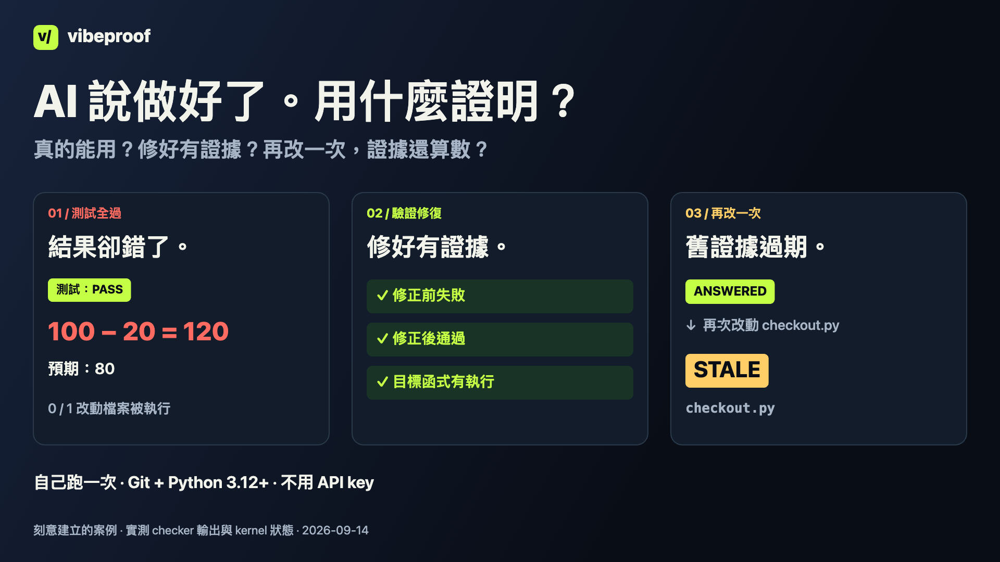

[English](README.md) · [简体中文](README.zh-CN.md) · **繁體中文**

# vibeproof

### AI 說做好了。看看它實際檢查過什麼。

你要的是能用的改動，AI 給你的是「測試全過」。但那些測試，真的碰過它剛改的程式嗎？

vibeproof 把可執行的檢查接進 Claude Code 和 Codex 任務，讓每次結果對應它當時看過的程式。先看一個故意寫錯的折扣例子：**100 − 20 算出 120，測試卻全過。**

**支援 Claude Code 和 Codex 的 git 專案。最容易開始：已經有測試的 Python 專案。** 雙宿主流程在 macOS 驗證；設定、信任及覆蓋限制見 [CODEX.md](docs/CODEX.md)。



[看普通話配音示範](docs/launch/assets/v4/demo-zh-TW.mp4) · [自己跑一次](#自己跑一次) · [用在你的專案](docs/GETTING_STARTED.zh-TW.md)

影片記錄的是 2026-09-05 示範基準。執行下方命令可驗證目前 checkout。

## 這三件事，你遇過嗎？

| 發生了什麼 | vibeproof 幫你檢查什麼 |
|---|---|
| AI 說測試全過，但新功能根本沒被測到 | 執行你的測試；對符合條件的 Python 改動，指出整次執行都沒碰到任何改動檔案的情況 |
| AI「重構」時，把測試刪了 | 與起始 commit 比較有效測試數量，報告減少的情況 |
| 只請它修一件事，卻改了其他地方 | Claude Write/Edit 和 Codex apply_patch hooks 會檢查任務允許修改的路徑 |

這些檢查有範圍：import 過檔案不等於測過功能；測試數量不代表斷言品質；刪測試預設只會報告；hook 也不是無法繞過的安全邊界。[查看完整限制](docs/REFERENCE.md)。

## 自己跑一次

需要 **Git 和 Python 3.12+**，使用 macOS 或 Linux；尚未驗證原生 Windows。示範不用安裝套件、不用 API key，也不用訂閱 coding agent。

```sh
git clone https://github.com/howardc38/vibeproof.git
cd vibeproof
python3 examples/first-proof/run.py
```

腳本會建立暫存 repo，執行真正的 checker，完成後清理暫存 repo。它不會把 framework 安裝到你的專案裡；clone 完即可離線執行。

100 元減去 20 元折扣，應該是 **80**。示範故意寫錯成 **120**，一條無關的測試卻仍然全綠。vibeproof 會指出：

```text
the suite passed and executed none of the 1 changed file(s):
  checkout.py
```

接著加入真正測到問題的測試，先看到它失敗，再修正程式。review checker 會驗證：**同一條測試修正前失敗、修正後通過，而且執行過目標函式。** 示範也會跑反例，讓你看到檢查的限制。

**過程出現 FAIL 是預期的。** 最後顯示 `DEMO VERIFIED` 才代表示範完整通過。這是刻意建立的案例，命令及輸出都是真實執行；不是錄下來的 AI 對話，也沒有展示完整 `ship` 流程。[看原始碼與執行紀錄](examples/first-proof/README.md)。

## 除了單次檢查，為什麼用整套流程？

| 接下來的麻煩 | 流程怎樣幫忙 |
|---|---|
| 剛剛 PASS，AI 又改了程式 | 相關輸入一變，舊證據就會過期，不能繼續當成目前已通過 |
| Reviewer 說修好了，卻沒有有用的回歸測試 | 有類型的 review finding 可以要求同一條測試修正前失敗、修正後通過，而且執行目標函式 |
| 一個警告不值得擋住今天的任務，但也不能忘掉 | 只報告的問題與執行紀錄仍留在 ledger；是否阻擋由 ship policy 判定 |

這些是值得試用整套組合的理由，不代表其他工具完全做不到。什麼才算正確行為，仍需要你的測試定義。

## 包含哪些功能？怎樣連在一起？

vibeproof 把一個任務的檢查、review 發現與目前仍適用的證據接成同一個流程：

```text
要求與範圍 → task
              ├─ detectors → claims
              └─ lenses + reviewer → review findings
claims → 必要的 engagement → checkers → 執行紀錄
當前 claim 狀態 + policy → HELD，或 SHIP 並列出剩餘報告
```

**會阻擋與只報告的 claims、checker 執行結果，都會記入 ledger。** Gate 模式決定什麼會擋住任務，不是決定哪些問題才值得記住。

| 包含什麼 | 對你有什麼作用 |
|---|---|
| 流程助手 | Claude agents／commands，加上由同一來源生成的 Codex roles／skills，操作 run、sweep、wave、maintain 流程 |
| Hooks | 在支援的寫入、shell 命令及停手時提早檢查；也會再檢查最後的 diff 範圍 |
| Detector → checker | 一部分程式提出適用的問題，另一部分實際執行檢查、記錄結果 |
| Review lenses | 提供設計適配、需求忠實度、測試充分性等 review 視角，補機械模式之外的判斷 |
| Ledger＋證據有效期 | 問題、嘗試與決定有任務歸屬；相關輸入改變時，舊答案會過期 |
| Ship policy | 有些類型立即阻擋，有些保留為可見報告；評估任務時可按門檻升級 |
| Runtime／UI 證明 | 執行你專案宣告的真實觸發、資料查詢或 UI 測試 |
| Checker 註冊驗證 | 用 red／green／bypass fixtures 和重跑一致性，檢查要加入的 checker |

Agent／command 提示檔與 lenses 提供操作指引，不保證 agent 已遵守。沒有指定 task 的 review finding 會進入常設 `repo-review`，不會自動阻止另一個任務出貨。

Coverage、測試鎖定、scope 工具也能處理個別檢查。考慮這套 framework 的理由，是在任務反覆修改時，一起追蹤待答問題、review 與仍然有效的證據。[完整功能與命令目錄](docs/FEATURES.md) · [以 code 比較同類工具](docs/launch/POSITIONING.zh-TW.md)

## 用在你的專案

[從安裝到第一個任務 →](docs/GETTING_STARTED.zh-TW.md)

agent 可以執行流程命令。你提供想要的結果、允許修改的檔案、真正的測試命令，以及是否接受未解決風險的決定。指南附可貼給 agent 的指示，也說明如何保留現有 Claude 設定再加入 hooks。

完整安裝會加入 checker、detector、fixtures、hooks 和提示檔，並先驗證 fixtures，因此比短示範花更多時間。你也需要確認專案的外部寫入和權限判斷等事實；安裝完成不代表程式已被全面驗證。

```text
要求與修改範圍 → 找出要檢查的項目 → 修改與測試 → 檢視結果 → ship 判定
```

相關程式或檢查輸入改變時，舊的通過結果會過期。`SHIP` 是 framework 按設定作出的判定，不會替你部署，也不保證每項需求都已滿足。

## 支援範圍

| 項目 | 目前能力 |
|---|---|
| 自動 hooks | Claude Code 和 Codex；見 [宿主設定](docs/CODEX.md) |
| 一般測試的改動執行追蹤 | Python 檔案層級；不是完整分支或斷言覆蓋 |
| 修正前後的 review 測試證據 | 有 Python、Go、Node/V8 路徑；取決於 runner |
| 程式結構檢查 | Python、Go、TS/JS 支援深度不同；Rust 較有限 |

另外可檢查部分吞錯、外部寫入、憑證、呼叫介面及引用問題，並執行你配置的 UI／runtime 證明。實際覆蓋取決於語言、事實表和環境。[技術參考](docs/REFERENCE.md)

## 使用前要知道

- hook 讀不到必要狀態時可能放行；Stop hook 只攔第一次。
- 部分問題預設只報告，不立即阻止 ship；風險可以被接受，包括由 agent 簽署。
- 本地帳本與 hash 有助留下證據，但不是不可修改的外部信任服務。
- 功能正確、安全性與設計品質，仍需要合適的測試和人的判斷。

[完整限制](docs/REFERENCE.md) · [完整流程](docs/USING.md) · [事實表格式](docs/FACTS.md)

## 幫我們做到你願意再用一次

試一個小任務後，[告訴我們結果](https://github.com/howardc38/vibeproof/issues/new?template=first-run.yml)：它抓到什麼、誤報什麼、哪一步最麻煩，以及下一個任務會不會繼續用。只需分享去除敏感資訊的紀錄，不需要私人程式或憑證。

執行 framework 自己的測試：

```sh
python3 tests/run_without_silent_skips.py
```

維護 vibeproof 本身時，請在 canonical 開發 repo 工作；見[貢獻方式](CONTRIBUTING.md)與[同步流程](docs/SYNC.md)。

MIT 授權。[授權條款](LICENSE) · [實作規格](docs/SPEC.md)
