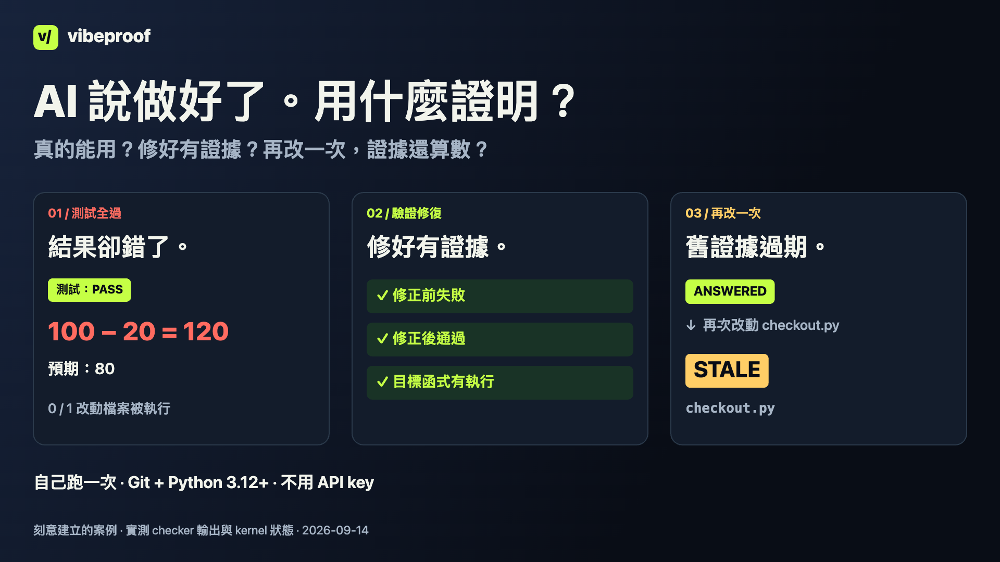

[English](README.md) · [简体中文](README.zh-CN.md) · **繁體中文**

# vibeproof

### 用 coding agent 開發，讓工作有據可查。

vibeproof 是供 **Claude Code 和 Codex** 使用的開發工作流程。從有明確範圍的需求開始，驗證改動、整合並行任務，並在專案持續演進時追蹤審查與修復。

你能查看一份任務紀錄：允許改哪些檔案、執行過哪些檢查、修復有什麼證據，以及哪些結果仍適用於目前的程式。根據這些結果，決定要接受哪些工作、哪些還需要處理。

[從專案的一項改動開始 →](docs/GETTING_STARTED.zh-TW.md) · [先跑獨立示範](#自己跑一次) · [了解工作流程](#從需求到有據可查的工作)

## 什麼時候值得試

- **開發功能或修復缺陷。** 讓預期結果、允許改動的檔案與驗證紀錄，跟著 agent 的工作一起保留。
- **整合並行任務。** 在獨立 Git worktrees 開發，整合後針對合併的程式重新檢查。
- **持續維護專案。** 追蹤審查發現與已授權的修復，知道哪些審查尚未完成、哪些證據已經過期。

**最適合先試：** 已有真正 Python 測試的 Git 專案，你已經用 coding agent，也花不少時間檢查它的工作。

## 從需求到有據可查的工作

1. **先說清楚任務範圍。** 指定想要的結果與 agent 可以修改的檔案，確認檢查所需的專案事實，並要求 agent 逐項交代需求。這些紀錄方便你核對交付內容，本身不判定需求是否已滿足。
2. **執行適用的檢查。** 框架依任務範圍找出適用的檢查，記錄結果。支援的編輯與停止 hooks 協助指出尚未處理的工作。任務政策區分會阻擋完成的問題，以及先報告、待處理的問題。
3. **拿出行為證據。** 執行專案真正使用的測試。審查發現的修復可連到一條測試：修正前失敗、修正後通過，而且執行過目標。已設定的瀏覽器／UI 測試與執行期查詢也可檢查其他行為。斷言是否有意義、專案如何設定，決定能證明什麼。
4. **知道何時重新驗證。** 先前的執行仍留在本地紀錄中；相關程式、設定或檢查有所改動時，先前結果可能過期。審查紀錄與受檢輸入相連，讓你區分完整、部分完成與已過期的審查。
5. **整合成果，繼續追蹤。** Coding agent 的宿主協調 worktrees 中的任務，合併後重新驗證。維護流程追蹤已授權的修復交接，可在相連的 worktree 重新檢查修復，並讀回原發現的狀態。定期審查需要宿主排程器內真正存在的工作。
6. **配合專案擴充檢查。** 加入自訂規則，用 fixtures 驗證。透過 `doctor` 檢視接線，查看已宣告風險的機制覆蓋、趨勢、已記錄成本與匯出紀錄。Monitor 審查檢查框架判準與專案事實的改動；可選通知協助提醒處理。

宿主啟動 agents 並排程定期工作。CLI 提供檢查與已記錄狀態；審查判斷與業務驗收仍需要合適的測試及決定。Telegram 通知送達或確認已讀，都不會關閉發現。

[完整功能地圖](docs/FEATURES.md) · [維護操作](docs/USING.md#periodic-maintenance-and-findings) · [技術參考](docs/REFERENCE.md)

## 用在你的專案

[從安裝到第一個任務 →](docs/GETTING_STARTED.zh-TW.md)

先在已經使用 agent 的專案中，選一項功能或修復。你提供想要的結果、允許修改的檔案、真正的測試命令，以及未解決風險的決定。指南帶你完成安裝與第一個任務，並附上可貼給 agent 的指示。

完整安裝會加入 checkers、detectors、fixtures、hooks 和提示檔，驗證 fixtures，並要求確認專案事實，因此比短示範花更多時間。

**選擇宿主：** 預設是 Claude Code。使用 Codex 時選 `--hosts codex` 或 `--hosts both`。`--activate-hooks` 會合併 framework handlers，保留無關的既有設定；Codex hooks 還需要在宿主內審閱及信任。[任務綁定與權限](docs/CODEX.md)

| 要做的工作 | Claude Code | Codex |
|---|---|---|
| 完成一項有明確範圍的改動 | `/run` | `$vibeproof-run` |
| 在獨立 worktrees 協調多個任務 | `/wave` | `$vibeproof-wave` |
| 按適用的 lenses 審查目前程式 | `/sweep` | `$vibeproof-sweep` |
| 查看 findings 並協調維護 | `/maintain` | `$vibeproof-maintain` |

## 示範：一次改動，三個證據重點

這個例子展示工作流程中的三個部分：測試沒有執行改動、修復經過驗證，以及再改程式後證據過期。從一個故意寫錯的折扣開始：**100 − 20 算出 120，測試卻全過。**

[](docs/launch/assets/v4/demo-zh-TW.mp4)

[看普通話配音示範](docs/launch/assets/v4/demo-zh-TW.mp4) · [自己跑一次](#自己跑一次)

### 1. 測試全過，結果卻錯了。

購物車應該是 **80**，實際卻是 **120**。一條無關的 `2 + 2` 測試仍然全綠。一般 Python checker 會指出：

```text
the suite passed and executed none of the 1 changed file(s):
  checkout.py
```

它指出缺少執行證據，不代表每條改動都已被測過：只 import 檔案，也可能通過這項普通檢查。

### 2. 修好，要有對得上的證據。

新回歸測試呼叫 `total(100, 20)`，預期得到 `80`，先在錯誤實作上失敗。修正後，review checker 驗證：**同一條測試修正前失敗、修正後通過，而且執行過目標函式。** 一條無關的綠色測試，不能充當修復證據。

這證明的是示範中的修復。測試仍需要有意義的斷言，不代表所有需求或分支都已正確。

### 3. 程式再改，舊證據過期。

示範把真正的 checker 執行記入暫存 ledger，然後再次改動 `checkout.py`。Kernel 會報告：

```text
ANSWERED → STALE
its subject moved: checkout.py
```

原本成功的執行紀錄仍然保留，但不能繼續當成目前有效的證據。`STALE` 表示需要重新驗證，不代表已找到新 bug。還原同一份已檢查的程式，該份證據便再次適用。

## 自己跑一次

需要 **Git 和 Python 3.12+**，使用 macOS 或 Linux；尚未驗證原生 Windows。示範不用安裝套件、不用 API key，也不用訂閱 coding agent。

```sh
git clone https://github.com/howardc38/vibeproof.git
cd vibeproof
python3 examples/first-proof/run.py
```

腳本會建立並清理暫存 repo。Clone 完即可離線執行，不會把 framework 安裝到你的專案裡。**過程出現 FAIL 是預期的；最後顯示 `DEMO VERIFIED` 才代表示範通過。**

圖片與影片重播 **2026-09-14 刻意建立案例**的實測輸出，包括真正的 checker 執行及 kernel 證據狀態查詢。旁白為合成語音，主持人像是虛構角色；它們不是錄下來的 AI 對話，也沒有展示完整安裝或 ship 流程。[原始碼、執行紀錄與反例](examples/first-proof/README.md)

## 支援的檢查與限制

Claude Code 和 Codex adapters 共用 kernel；原生宿主驗證在 macOS 進行。[宿主設定與限制](docs/CODEX.md)

結構與憑證檢查按語言和專案 facts 涵蓋部分模式。測試改動檢查報告數量下降及部分 expectation／shape 變化，斷言品質分析有限。

一般測試的改動檔案執行追蹤只支援 Python。可執行的 review 修復路徑包括 Python、Go 和 Node/V8，取決於 runner。經驗證的同檔案 Python 函式／方法改名可保留原 finding。結構檢查對 Python、Go、TS/JS 的支援深度不同，Rust 較有限。

[完整功能地圖](docs/FEATURES.md) · [技術參考](docs/REFERENCE.md) · [Facts 格式](docs/FACTS.md)

## 看清楚結果代表什麼

- `SHIP` 是按設定作出的任務判定，不會部署程式，也不保證每項需求都已滿足。
- 部分問題先報告而不阻擋；刪測試預設只報告。常設 `repo-review` 的 finding 不會自動阻止另一個任務。
- Hooks 涵蓋支援的宿主輸入，狀態不可讀時可能放行。Stop 檢查在同一次停止流程只攔一次，之後獨立回合可再檢查；hooks 不是 sandbox。
- 本地 ledger 與 hash 不是不可修改的外部信任服務。存在接受風險的路徑，包括 agent 簽署。
- 提示檔、review lenses 與完成紀錄，不證明獨立判斷。業務正確性與安全仍需要合適的測試及人的決定。

[完整限制與 exit codes](docs/REFERENCE.md) · [完整流程](docs/USING.md)

## 試一個真實改動

[告訴我們結果](https://github.com/howardc38/vibeproof/issues/new?template=first-run.yml)：它抓到什麼、誤報什麼，以及下一個任務會不會繼續用。只需分享去除敏感資訊的紀錄，不需要私人程式或憑證。

執行 framework 自己的測試：`python3 tests/run_without_silent_skips.py`。

維護 vibeproof 時，請修改 canonical 開發 repo；見[貢獻方式](CONTRIBUTING.md)與[同步流程](docs/SYNC.md)。

MIT 授權。[授權條款](LICENSE) · [實作規格](docs/SPEC.md)
