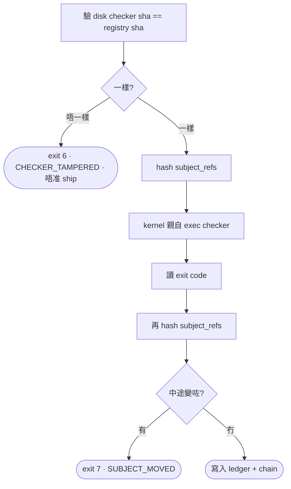

<!-- WHY, not what.

The implementation contract is docs/SPEC.md. This file is the argument behind
it: what the previous system measured out at, which proposals were killed and
by what, and every claim this project has had to retract.

Read it to challenge a decision. You do not need it to implement one.

It keeps its retractions in place on purpose. Four of the sentences it
originally leaned on turned out to be false, and a document that quietly
deletes its own mistakes teaches nothing about how much to trust the rest.
-->

# vibeproof

**一個 task = 一堆問題。每條問題有一個程式去答。Kernel 親自跑嗰個程式、自己讀 exit code、寫低答案。全部答完就出貨。**

冇 step、冇 cycle、冇散文合約、冇 phase doc。

> **本版本(rev 2)經四輪 adversarial review 大改。** 上一版有三句承重句係假嘅、一條成本算術錯咗、一個 loop 產生器。全部喺 §19 逐條列明,包括我**故意留低**嘅風險。想知邊度改咗同點解,由 §19 睇起。

---

## 1. 你實際打咩

```
你 :  /run "把通知加 brand 前綴,修 scheduler 個 race,加庫存同步"
       ↓
      (LLM 拆 task · 寫 code · 自己修到 claim 全綠 · review · ship)
       ↓
你 :  收到報告 —— 3 個 task ship 咗,1 個等你簽一個 accepted-risk
```

### Command

| V3 | V4 | 邊個做 |
|---|---|---|
| `/phase-author` | **併入 `/run`** | LLM 自己拆,冇人手 |
| `/phase-execute` | **`/run`** | 拆 task · 寫 code · check · review · ship |
| `/review-code` | **併入 `/run`** | 由選修變自動 |
| `/test-audit` | 變 reviewer lens | |
| `/augment-guideline` | **`/checker new`** | 產物由散文變可執行檔 |
| `/phase-chain-review` · `/authority-doc-cleanup` · `/framework-cleanup` | ✗ | 見 §12 |

`v4 task` / `v4 check` / `v4 status` / `v4 ship` / `v4 scope widen` 係 **kernel CLI**,由 command 同 agent 叫,唔係你打。

### Agent

**呢張表講嘅係「佢寫唔到咩」—— 契約嗰張喺 `SPEC.md` §12.5,嗰張先係權威。**
兩張問唔同問題:嗰張講邊個機制執行,呢張講 ledger 唔畀佢寫乜。

**每個角色造乜,由 `SPEC.md` §12.5 嗰張表擁有,呢度唔重複。** 呢一欄一度寫住
`task-splitter` 出「N 個 task」,而契約寫住一個 —— 而個分別唔係字眼:`re-split`
未起(§18.3),所以「拆成 N 個」今日冇出口,拆錯咗就卡死。一句順手抄過嚟嘅描述
講咗一件同契約相反嘅事,而兩份文件都冇機制發現。

| Agent | 寫唔到咩 |
|---|---|
| `task-splitter` | attempt |
| `worker` | attempt · exit code · digest |
| `reviewer` × lens | verdict |
| `checker-author` | attempt。**註冊要 red fixture,見 §7.3** |

> **`claim-review` agent 剷咗**(rev 2)。理由:佢係一個 LLM 對另一個 LLM 出主觀判詞,而個判詞擋 ship —— 即係「LLM 判詞決定出唔出貨」冇消失,只係換咗個 agent 名。詳見 §9。

---

## 2. 三個角色

| 角色 | 做咩 |
|---|---|
| **人(你)** | 打一句 request · 簽 accepted-risk(§2.1) |
| **LLM** | 其餘全部:拆 task · 寫 code · 叫 check · 寫 engagement · review |
| **Kernel** | 跑 checker · 讀 exit code · 寫結果 · 推導狀態 · ship gate |

### 2.1 Attempt 嘅寫入邊界 —— 老實講佢係咩

**rev 1 寫「冇任何 LLM 寫得到一個 attempt」。呢句係假嘅。** worker 有 shell,ledger 係一個路徑已知嘅 SQLite 檔:

```
sqlite3 $(git rev-parse --git-common-dir)/v4/ledger.db "INSERT INTO attempt ..."
```

冇 file permission、冇獨立 uid、冇 socket boundary 擋得住。

> ⚠️ **上面呢句啱,但由佢推出嘅結論錯咗,而且錯咗好耐。**
>
> 「冇 boundary 擋得住」係真嘅。**但嗰條被引用嘅指令實測係擋得到嘅** ——
> 用一個 `BEFORE INSERT` trigger,條件係一個只有 kernel 喺自己條 connection
> 註冊嘅 function:
>
> ```
> kernel,喺 writing() 內      寫得入
> kernel,喺 writing() 外      ABORT: inserts into attempt go through the kernel
> 外部 python sqlite3          no such function: v4_kernel_can_write
> 外部 sqlite3 CLI             no such function: v4_kernel_can_write   ← 就係上面嗰條
> DROP TRIGGER 之後            寫得入
> ```
>
> 最後一行係真嘅,而且一句就做到 —— **所以佢唔係 boundary。** 但佢把成本由
> 「一句 shell」變成「先 drop 個 trigger」,而 drop 咗嘅 trigger 下次
> `connect()` 會補返 —— 即係嗰行偽造 row 坐喺一個 schema 話佢寫唔入嘅資料庫入面。
>
> **「偵測得到,阻止唔到」對一個 boundary 嚟講係誠實嘅講法。對呢樣嘢嚟講唔係。**
> 而前身早就起咗呢個機制;V4 抄咗佢個 `no_update`/`no_delete` trigger,冇抄
> INSERT gate,亦冇喺任何地方記錄過呢個決定。20 行,零 daemon。
>
> 呢個 repo 曾經有一個叫 `test_forged_row_is_detected_not_prevented` 嘅 test。
> 佢而家叫 `test_an_outside_connection_cannot_insert_at_all`。

**改成真話:**

| | |
|---|---|
| **保證** | Kernel 係唯一**應該**寫 attempt 嘅嘢。一個冇註冊 write gate 嘅 connection **插唔到**;任何真係入到嘅越界寫入**事後驗得出**(hash chain,§6.3) |
| **唔係保證** | 「絕對寫唔到」。DROP TRIGGER 打得低個 gate,而真 boundary 要 daemon / 獨立 uid,V4 唔起(§15) |
| **錨** | CI 同人手 review 睇 `v4 audit` 嘅 chain 驗證結果,唔係靠 kernel 自己 |

**而 rev 1 剷 hash chain 嘅理由係錯嘅。** 我寫「【驗】84% evidence 係 wrapper 真捕捉,呢個威脅冇發生過」—— 但 **V3 當時有 hash chain**。「防禦期間冇事發生」係「防禦有效」嘅證據,唔係「威脅唔存在」嘅證據。呢個係 Wald 轟炸機裝甲:冇被射中嘅機頭。**Chain 還原,20 行,§6.3。**

### 2.2 唯一人手觸點:`ACCEPTED_RISK`

`ACCEPTED_RISK` = 「呢樣證明唔到,但我接受」。要一個具名嘅人,因為佢嘅意思就係「有人承擔咗」。

```
policy: allow_accepted_risk   ← 偶爾彈出嚟叫你簽一次
policy: no_accepted_risk      ← 永遠唔煩你,但證明唔到嘅 task 會卡住
```

**二揀一,冇第三條路** —— 「冇人簽都可以接受風險」等於「冇風險控制」。

#### 佢有 `kind`,因為四類完全唔同嘅嘢會撞埋一齊

```
accepted_risk.kind ∈ { unprovable, no_checker, baseline_raise, scope_widen_protected }
```

**唔分 kind,簽嗰個人睇唔出自己簽緊咩** —— 就係我 §17.4 批評 V3 P0/P1/P2 嗰個假動作嘅鏡像。

#### 簽名機制:摩擦,唔係邊界

```
./bin/v4 risk accept --claim <id> --kind <kind> --why "<理由>"
```

- `stdin` 唔係 TTY → 拒絕。**但呢個唔係 boundary** ——`pty.spawn(['v4','risk','accept',…])` 一行就過。**rev 1 寫「agent 由結構上簽唔到」係錯嘅。**
- **三條路過到呢個檢查,而三條唔等價,所以邊處講其中一條就要講齊三條**(`risk.TTY_ROUTES`):`--no-tty-check` 記 `signed_by: agent`;一個 pty 記 `person`,即係一個冇人簽過嘅簽名;`--as-monitor` 記 `monitor`,得一個唔係做呢份工嘅 session 用得。
- 記低:`git config user.email`(agent 改得到,所以唔係身份證明)· 時間 · 理由 · kind · claim id · **`stdin.isatty()` 當時嘅實際值** · **`signed_by`(三條路邊一條)**。後面嗰個要獨立記,因為 `--no-tty-check` 同 `--as-monitor` 兩條都係 `isatty = False` —— 淨靠實際值分唔開一個 worker 簽走判佢自己嗰條 claim,同一個第二 session 簽一條 detector claim。
- **真錨:**每個 `accepted_risk` 同時寫一個 signed record 落 git(`.v4/risks/<claim>.json`,入 commit)。**繞過就喺 diff 度睇得見。**

#### ⚠️ 佢嘅頻率係一個未申報嘅未知

§1 承諾「中間唔使你」,而呢個承諾嘅單點就係 `ACCEPTED_RISK` 出現得有幾密。**我冇量過,亦冇辦法喺跑之前量。** 列入 §16。

---

## 3. 解緊咩問題

| # | 失敗模式 | 實測證據 | 機制 |
|---|---|---|---|
| **F1** | 「我做咗」但冇做 | `complete-step --gate-result PASS` 由 agent 打;proof gate **0 次 FAIL** | **Kernel** 親自 exec,自己讀 exit code |
| **F2** | 「我知規則」但嗰一刻唔 engage | read-evidence 嘅 conclusion **96.7% 由框架自己填**(39,701 條入面 38,392);真人手寫得 64 條 | **Engagement**:條件觸發,LLM 寫,冇預設值(**未經證實**,§9) |
| **F3** | 「睇落冇問題」 | 三個 reviewer 每輪出 **3.6 個 finding,每輪都係新嘅** → 抽樣器唔係窮舉器 | **Reviewer 出 claim 唔出 verdict** |

### 3.1 成本子句 —— rev 1 呢度算錯咗

**rev 1 寫「失敗只重試嗰一條」。呢句同我自己 §6.2 嘅規則矛盾。**

修 claim-4 要改 `notifier.py`。而 `notifier.py` 同時喺 claim-1(`test`)、claim-2(`scope`)、claim-3(`lint`) 嘅 subject 入面 —— 佢哋**一齊變返 OPEN**。而 `test` claim 全套跑(§18.1),佢嘅真實依賴面係成個 repo。

**真正嘅重試單位:**

```
唔係「一條 claim」
係「所有 subject 同你改動相交嘅 claim」—— 而 test / lint 呢類 repo-scoped claim 每次都相交
```

**慳嘅嘢仍然真,但係另一個理由:**

| | V3 | V4 |
|---|---|---|
| 一次失敗要重跑咩 | **重開 namespace,由 Step 1 行足八步** | 相交嗰批 checker |
| 實際時間 | 【驗】F270 九輪 Step 1 = **2 小時 36 分,0 行 code** | 全套 test 72 秒 + 幾個秒級 checker |

**慳嘅係「一個 lifecycle 對比幾個 checker run」,唔係「一條對比全部」。** 63% rework 嗰個數要重計 —— 列入 §16。

### 3.2 兩種貨幣,有次序

| 子句 | 慳咩 |
|---|---|
| **失敗只重跑相交嗰批** | **總工作量** |
| **並行** | **牆上時間** |

【驗】並行牆上時間由**最慢嗰一個 task** 封頂,而拖長尾巴嘅就係 remediation cycle(單 cycle phase p90 1.7h,多 cycle 4.9h)。**cycle 唔拆,並行封喺 2.6×;拆咗先去到 6.4×。**

**所以並行押後到實驗之後(§13)。**

---

## 4. Claim 係咩

**一條 claim = 一條問題 + 佢關於邊啲嘢 + 一個答佢嘅程式。**

```
claim-4
  問題      :  bot.send_message 之後有冇讀返確認?
  關於邊啲嘢 :  app/chat/notifier.py, tests/chat/test_notifier.py
  邊個答     :  checkers/external-write-readback
```

| V3 有嘅 | V4 喺邊 |
|---|---|
| Step 3 寫 code | **唔係 step。就咁寫。** 唯一介入係 write hook 擋住寫 scope 以外(§10.3) |
| Step 4/5/6 proof | 一條 `test` / `runtime` / `surface` claim |
| Step 7 review | reviewer 讀 diff,每個 finding 變一條新 claim(**點關閉見 §4.4**) |
| Step 1 contract | **冇咗**。claim 集就係佢,而且係推導出嚟唔係寫出嚟 |

### 4.1 Claim 點推導出嚟

**成個 V4 靠呢一步。** V3 由散文推導 → 散文一改 claim 就變 → Loop A。V4 由 **repo 事實**推導。

#### 全部 claim 都由 detector 出 —— 冇「無條件」特例

rev 1 把 `test` / `scope` / `lint` 硬編入 kernel。**呢個直接違反 §7 自己嗰條反增長規則**(「加新規則 = 加新檔案,唔使改 kernel」),而且第四條無條件 claim 一出現就要改 kernel。

```
detectors/always_test.py   →  print("V4-CLAIM: kind=test")      # 3 行
detectors/always_scope.py  →  print("V4-CLAIM: kind=scope")     # 3 行
detectors/always_lint.py   →  print("V4-CLAIM: kind=lint")      # 3 行
```

**Kernel 得一條 derivation 路徑:跑晒 `detectors/` 入面所有嘢,收 `V4-CLAIM:` 行。**

#### Detector = 同 checker 一樣嘅形狀

收同一份 `--subject` JSON(§7.1),加一份 `--facts`(§7.2)。輸出:

```
V4-CLAIM: kind=<enum> file=<path> symbol=<enclosing symbol> variant=<enum> line=<int>
```

| 欄 | 規矩 |
|---|---|
| `kind` | **必須喺 `claim_kinds.json` 入面**,唔喺就 kernel 拒收成行 |
| `file` | **必須喺 task 嘅 scope 入面**,唔喺就拒收 |
| `symbol` | 包住嗰個 function / class 嘅名。**identity 嘅一部分** |
| `variant` | kind 自己定義嘅 enum(例如 `readback` / `replay`) |
| `line` | **只做顯示。唔入 identity。**(見下) |

**Detector exit:只有 `0` = 掃過。其餘一律當「冇跑」** —— kernel 寫一條 `detector_run` event(`ran: False`,連 exit code 同 stderr)然後繼續(`kernel/derive.py`);`v4 ship` 喺 `detectors_not_run` 逐個列出,**但唔會因此扣住 ship** —— ship 只睇 blocked claim、hash chain、同 facts 表未確認嘅 `absent`(§6.4)。呢度原本寫「其餘一律 ERROR,唔准 ship」,而今日嘅 code 唔係咁做:一個冇跑嘅 detector 係 ship 報告一行,唔係一道閘。rev 1 只定義 0 同 ≥3,漏咗 1 同 2 —— 一個 crash 咗但 exit 1 嘅 detector 會被當成「掃完,零條」,**fail open 而且靜到冇聲**。

| Detector | 點偵測 | 出幾多條 |
|---|---|---|
| `external-write` | AST call site,symbol 對 `facts.outbound` 清單。**只出 write 類**(POST/PUT/PATCH/DELETE/send/publish);GET 唔出 | 每 site 2 條:`readback` · `replay` |
| `fail-closed` | AST `try`,body 有 outbound call 或者身份/權限判斷,而 handler 冇 `raise` | 每 site 1 條 |
| `surface-proof`(設計時叫 `surface`;今日係 `detectors/surface_proof.py`) | 設計:subject 掂到 `facts.ui_globs` | 1 條 |
| `runtime-proof`(設計時叫 `runtime`;今日係 `detectors/runtime_proof.py`) | 設計:subject 掂到 `facts.entrypoint_globs` | 1 條 |
| `secret` | 設計時由 config 檔觸發;今日係 `always_secret.py`,每個 task 一條 | 1 條 |
| ~~`bundle` · `dependency` · `external-scan`~~ | 設計:subject 掂到 lockfile / bundle 入口。**今日冇一個係註冊 kind** —— `dependency`(`checkers/dependency_audit.py`)同 `bundle-secret` 喺 2026-08-24 `a9ae5fb` 剷走,`external-scan` 從來冇註冊過 | — |

> **`external-write` 只出 write 類係 rev 2 嘅修正。** rev 1 判準寫「symbol 對 outbound 清單(`requests.*`)」—— 而 `requests.*` 包 `requests.get`。**即係:你為咗答 readback claim 而加一個 GET,個 GET 自己又觸發一條新 readback claim。無限。** kind 叫 external-**write** 但判準讀寫不分,呢個係 rev 1 一個真 loop 產生器。

#### Claim identity 唔含行號

```
claim_id = sha256(task_id ‖ kind ‖ file ‖ symbol ‖ variant)
```

**兩處改動,兩個都係修 loop:**

| 改 | rev 1 點解爛 |
|---|---|
| **剷走行號** | `site=notifier.py:88` 入 hash。你喺第 20 行加個 import,88 變 91 → ship 前重掃生一批新 id → 舊嗰批變孤兒(append-only 剷唔走)→ ship gate 擋 → 你去答 → 再改檔 → 再 churn。**每個 task 機械性必然發生。** 用 `symbol` 就對行號位移免疫 |
| **加 `task_id`** | rev 1 個 id 唔含 task。同一個 site 被兩個 task 掂到 = 同一個 claim_id,但 claim 表又 key by task。並行之下 worker A 喺自己 worktree 嘅 PASS 會令 worker B 嗰條同 id 嘅 claim 睇落已答 —— 而兩份檔內容完全唔同 |

**`subject_files` 亦唔入 id**(rev 1 入咗)。理由一樣:subject 會隨住 widen 而變,入咗 id 就等於同一個缺陷生兩條 claim。

#### 幾時跑 derivation

| 幾時 | 掃咩 |
|---|---|
| **task 開嗰陣** | base commit + declared scope |
| **`v4 scope widen` 之後** | **全掃**(唔係只掃新檔) |
| **`v4 ship` 之前** | **實際 diff** |

**全掃唔係浪費:**claim_id idempotent,舊 claim 回同一個 id,唔會重複開。rev 1 嘅「只掃新加嗰幾個檔」係第二條 code path 買緊 idempotency 已經免費提供嘅嘢。

#### Ship 前重掃嘅終止條件

**rev 1 冇呢個,而佢係 loop。** 答一條 ship-時新增嘅 claim 要改 code → 改咗 diff 就唔同 → 要再掃 → 再有新 claim。

```
ship 前重掃 → 有新 claim → 答佢 → 再掃 → …
```

**收斂條件(全部要成立,否則就係 loop):**

| 條件 | 靠咩 |
|---|---|
| ① 同一個缺陷唔會因為改動而換 id | identity 用 `symbol` 唔用行號 |
| ② 答一條 claim 唔會製造同類新 claim | `external-write` 只出 write 類;detector 判準要過 §13 階段 2 嘅「自我觸發測試」 |
| ③ 有硬上限 | **ship 前重掃最多 3 輪。**第 3 輪仲有新 claim → task 標 `ship_not_converging`,報你知 |

**③ 係治標,我知。** 但 ①② 係治本,而③ 存在嘅唯一理由係:如果 ①② 有窿,我要知,而唔係跑到天光。**第 3 輪觸發 = 有 detector 判準寫錯咗,係一個 bug report 唔係一個要人簽嘅風險。**

#### Detector 掃唔到嘅語言

冇對應 detector 嘅語言,個 task **只會得 always_* detector 出嘅 claim**。今日 `detectors/` 有 9 個 always_* detector:4 個係框架專用(`applies_to: framework` —— control-plane-budget、dead-wiring、registry-consistency、spec-coverage),1 個要 repo 自己宣告先跑(layer-boundary,要 `.v4/layers.json`),所以一個 adopter 攞到嘅係 `scope` · `secret` · `test` · `lint`(宣告咗 layers 就多 `layer-boundary`)。kernel 寫一行 `detector_run(ran=0)`,而且 **`v4 ship` 會讀佢**:

```
ship 報告必列:呢個 task 跑咗邊幾個 detector、邊幾個冇跑(連原因)
```

**rev 1 話「照寫落 ledger,唔係當冇問題」但冇任何嘢讀 —— 冇消費者嘅誠實記錄係另一種假動作**(就係我 §17.4 批評 V3 severity 嗰種)。

### 4.2 Claim 嘅 subject 可以係一個 attempt,唔淨止係檔

**rev 1 §8.2 吹「surface claim 嘅 subject 包含 runtime 嘅觀察結果,V4 冇得唔綁」—— 假嘅。** validity 只 re-hash **檔**,而 runtime 重跑一個檔都冇改,所以 surface **永遠唔會** OPEN。

```
subject_refs = [
  {"kind":"file",    "path":"web/ui/src/App.tsx"},
  {"kind":"attempt", "claim":"claim-5"}          ← runtime claim
]
```

**Staleness 兩者同等對待:**檔比 sha256;attempt ref 比「claim-5 最新 attempt 嘅 id」。runtime 一重跑 → 新 attempt id → surface 立即 STALE。**呢次先係真綁。**

> **2026-09-02 註:個機制喺 kernel 度,但冇 kind 用。** `kernel/derive.py::subject_refs_for` 會為宣告咗 `depends_on_kind` 嘅 kind 加一個 `{"kind":"attempt"}` ref,而 `.v4/claim_kinds.json` 今日**一個 `depends_on_kind` 都冇**。`surface-proof` 係 repo-scoped,`reads` 係 `**` —— runtime 重跑之後 surface 會唔會 STALE,取決於 worktree 有冇變,唔係 attempt ref。上面「呢次先係真綁」講嘅係設計;現況係一條冇人接嘅線。

### 4.3 Staleness 嘅範圍要逐個 claim 宣告

rev 1 一律用 subject 檔 hash。**兩個地方爆:**

**① 我自己引嘅事故,佢自己個機制發現唔到。** §6 我寫「再 hash 一次」嘅理由係「另一個 agent 中途改咗 `settings.py`,`11 passed` 變 `10 failed`」—— 但 `settings.py` **唔喺**嗰條 notify claim 嘅 subject 入面。個機制由頭到尾都唔會發現嗰次事故。

**② Merge 之後跨 task 語意破壞完全隱形。** task A 改 `core/x.py`,task B 喺 `app/y.py` call 佢。A merge 之後 B 嘅 subject **一個字都冇變** → B 一條 claim 都唔 OPEN → 零驗證出貨。**呢個正正就係我剷走嗰個 merge gate 要防嘅嘢**,而「89% 乾淨 merge」只量咗 git 文本層,對語意破壞零 informative。

```
claim_kinds.json 每個 kind 宣告:
  "staleness": "subject"   ← 只睇 subject_refs        (dangling-ref, external-write, fail-closed, review-finding, test-shape)
  "staleness": "repo"      ← 睇 worktree 內容          (test, lint, scope, surface-proof, 同其餘所有 kind)
```

**`repo`-scoped claim 嘅 key 係 worktree 內容,唔係 HEAD。**
<!-- pinned: kernel/hashing.py::worktree_digest -->
<!-- pinned: kernel/state.py::_staleness_key -->

⚠️ **原本寫「睇 HEAD commit」,而嗰個係一個冇痕跡嘅後門。** Worker 喺 worktree 改檔係 **uncommitted**,HEAD 一個字都唔郁:①寫個一定過嘅 stub ②`v4 check` 攞晒綠 ③寫真嘢唔 commit ④`v4 ship` —— 三條 repo-scoped claim 仍然 ANSWERED。**出貨嗰堆 bytes 由頭到尾冇跑過 test,而 ledger 乾淨、chain 驗得過。**

第一版係 `digest = sha256(HEAD ‖ git diff HEAD ‖ 每個 untracked 檔嘅 sha)` —— 而嗰個係**相對一個 commit** 嘅內容:commit 一次,diff 清空,digest 就變,ship 前每條 repo-scoped claim 都 STALE(EVIDENCE.md §5 量過)。而家係每個路徑一個 git blob hash,而且只覆蓋個 checker 喺 `.v4/checkers.json` `reads` 宣告會讀嘅路徑(`kernel/hashing.py::worktree_digest`)—— bytes 變佢就變,stage 同 commit 都唔郁佢。Regression test:`tests/test_kernel.py::UncommittedWorkIsNotInvisible`。

### 4.4 Reviewer 出嘅 claim 由邊個答 —— rev 1 最大嘅窿

`checker-author` 要等一類 finding **出現第三次**先寫 checker。所以第一二次結構上**冇 checker**。rev 1 個 §5 walkthrough 就咁寫住 `claim-6 → PASS`,冇講邊個 exec。

兩條路都爛:擋 ship → 每輪 3.6 個湧去 `ACCEPTED_RISK`(打死「偶爾」);唔擋 → 就係 advisory,即係我剷走嗰個 severity 假動作換個名。

**答案:red-green,kernel 驗。**

```
review claim 只有一個關閉方式:綁一條新 test
   ① checkout parent commit(用 throwaway worktree,live tree 唔郁)→ 跑 → 必須 FAIL
   ② 返 HEAD → 跑 → 必須 PASS
   ③ 條 test 一定要真係執行過 claim 嗰個 symbol
   三個都成立 → claim 答咗
```
<!-- pinned: kernel/redgreen.py::verify -->

**③ 係後加嘅,而且冇佢成個機制係裝飾。**【驗,真檔真行】`adopter_a` 有個 test 咁寫:

```python
assert "with _registry_cache_lock" in inspect.getsource(make_brand_registry)
```

剷走個 lock 佢會 fail,所以佢**完美滿足 ①②** —— 而佢由頭到尾冇 call 過嗰個 function。冇 ③,worker 用一行 `inspect.getsource` 就關到任何一條 review claim。

實作:`sitecustomize` + `sys.settrace`/`threading.settrace`,**唔綁任何 test runner**。

| 買到咩 | |
|---|---|
| **唔使 checker** | 呢條路對任何 novel finding 都通,唔使等第三次 |
| **agent 造唔到假** | 一條永遠 PASS 嘅 test 喺 parent commit 都會 PASS → ① 唔成立 → 拒 |
| **同 kernel 現有能力一致** | kernel 本來就識 exec + 讀 exit code。多咗嘅只係一個 `git worktree` + 跑兩次 |

**答唔到嘅 review claim** → `ACCEPTED_RISK kind=no_checker`。呢個係一條真出路,但佢有 kind,所以數得到(§2.2)。

### 4.5 `V4-CLAIM:` 唔准帶散文

rev 1 個例子係 `V4-CLAIM: kind=fail-closed file=… 「catch 之後清走 baseline,下次會重出」` —— **一句 LLM 寫嘅中文散文**,直接打死 §4.1「冇任何 LLM 寫得到呢句(問題句)」。而 `kind=` 由 LLM 揀 = 揀邊個程式審佢;`file=` 由 LLM 揀 = 揀 hash validity 睇邊個檔。一個 reviewer 可以出 `kind=lint file=README.md` 換一條必然 PASS 嘅 claim。

| 欄 | 邊個定 | 入唔入 identity |
|---|---|---|
| `kind` `file` `symbol` `variant` | **enum / 位置,kernel 驗** | 入 |
| `line` | detector | **唔入** |
| `note`(自由文字) | 出 claim 嗰個 | **唔入。唔參與 checker 選擇。只做顯示** |

**問題句一律由 `claim_kinds.json` 嘅模板生成。**

---

## 5. 走一次(單一 task)

```
/run "通知加 brand 名前綴"
   ↓
task-splitter → 1 個 task:request + scope=app/chat/
   ↓
kernel 跑晒 detectors/ →
   claim-1  test            (always_test)          staleness=repo
   claim-2  scope           (always_scope)         staleness=repo
   claim-3  lint            (always_lint)          staleness=repo
   claim-4  external-write  notifier.py :: notify  variant=readback
   claim-5  external-write  notifier.py :: notify  variant=replay
   ↓
Engagement 觸發(因為有 external-write claim):
   worker 打一句 → kernel 七條機械判準 → 過 → 開工
   (拒 → 即刻重寫,冇次數上限,因為判準客觀、必定滿足得到。§9)
```

```
worker 寫 code
   ├─ app/chat/notifier.py        ✓
   └─ 想寫 core/config/settings.py    ✗ write hook 當場拒絕(超出 scope)→ 見 §5.1

v4 check
   claim-4 FAIL   exit 1 · stdout: "notify() 之後冇再 GET message,冇 readback"
   → 加返 readback → v4 check
   → claim-4 PASS · claim-5 PASS
   → 但 claim-1/2/3 因為 staleness=repo 而 STALE → 一併重跑 → 72 秒 → PASS

/review
   reviewer 讀 diff → V4-CLAIM: kind=review-finding file=notifier.py symbol=notify
   問題句由模板生成,note 帶住 reviewer 講嗰句
   → worker 寫一條 test 釘住「brand 名爆 4096 字元」
   → kernel red-green:parent commit FAIL ✓ · HEAD PASS ✓ → claim 答咗

v4 ship
   ① 用實際 diff 重掃 → 冇新 claim(第 1 輪就收斂)
   ② 全部 claim terminal
   ③ 報告列明:當時跑咗 5 個 detector,0 個冇跑
   → 出貨
```

### 5.1 Worker 發現 scope declare 錯咗

「事前 declare + 事後強制執行」就係 V3 兩個 loop 嘅共同結構。**V4 保得住嘅唯一方法,係令修正 declaration 嘅代價細,而唔係令 declaration 更難寫錯**(V3 試過,結果係 Step 1 行九次)。

```
v4 scope widen --add core/config/settings.py --why "…"
   ↓
kernel : ① 寫 scope_widen event
         ② 全 repo re-derive(idempotent,舊 claim 唔郁)
         ③ 觸發 engagement —— 但**豁免去重判準**(見下)
   ↓
worker 繼續。冇 re-plan、冇 re-split、冇重跑已答 claim。
```

**去重豁免係 rev 2 嘅修正:**rev 1 §9 個「同本 task 內其他 engagement 句 token 重疊 > 0.8」會令**第二次 widen 開始必然被拒**(同一 task、同一 worker、同類理由,句子必然似)。§5.1 要 widen 平、§9 要句句唔同 —— 兩節互相打。

#### 永遠唔可以 widen 入去嘅路徑

```
.v4/**          ← config,即係 test_command,即係 test claim 嘅裁決者
checkers/**     ← 審判者本體
detectors/**    ← 合約產生器
.github/**      ← CI
```

**點解要有呢個清單:**rev 1 冇,所以「擴 scope」同時係「改自己個審判者」嘅**合法動作**。而 `.v4/config.json` 唔係 subject file —— 改咗**唔會**令任何已 PASS 嘅 claim 變 OPEN。一句 `test_command: "pytest -k nothing"`,全部 task 嘅 test claim 永遠綠。

想改呢啲路徑 → `ACCEPTED_RISK kind=scope_widen_protected`。

#### `--why` 同 engagement 用同一組機械判準

rev 1 對 engagement 五條判準、對 `--why` 零檢查。同一件事(LLM 寫一句),雙重標準。

#### ⚠️ 濫用防線係「量」,而個量要有消費者

`v4 status` 同 ship 報告**必列**:呢個 task widen 咗幾多次、加咗幾多檔、佔 repo 幾多 %。**冇 gate 擋(有 gate 就係 V3),但個數字要有人睇得見。** rev 1 寫「靠量」但冇任何 command 出呢個量。

---

## 6. Kernel

| 功能 | 做咩 |
|---|---|
| `ledger` | append-only SQLite,喺 `$(git rev-parse --git-common-dir)/v4/ledger.db` |
| `v4 check` | 解析 subject → hash → **驗 checker sha == registry sha** → 親自 exec → 讀 exit code → 再 hash → 記低 |
| `v4 status` | 逐條 claim 重新推導狀態 |
| `v4 ship` | §6.4 |
| `v4 audit` | 驗 hash chain(§6.3) |
| `v4 scope widen` | §5.1 |
| `v4 risk accept` | §2.2 |

### 6.1 跑一條 claim



**「驗 checker sha」係 rev 2 加嘅,而且佢封死一條標準作弊路:**rev 1 兩張表都有 checker sha256,但**冇一個決定讀佢**,而 validity 亦唔睇 checker。所以一條 FAIL 嘅標準修法係「改個 checker → 重跑 → PASS」,ledger 睇落完全正常。**同 V3 `rerun_start_step` 同一個形狀:寫咗,冇人讀。**

**Checker sha 亦入 staleness key:**checker 改咗 → 佢服務嘅所有 claim 變 STALE。你補完 `fail-closed` 嘅漏洞,舊 PASS 應該失效。

### 6.2 狀態係 query,唔係欄位

**冇 `status` 欄位。** 一條 claim 嘅狀態每次問都重算:佢最新嘅 attempt、`STALE` 一行嗰六樣輸入而家嘅值、有冇 `retracted` event、有冇人簽過。

| 狀態 | 點推導 | Terminal? |
|---|---|---|
| `OPEN` | 冇 attempt,或者最新 exit 1 | ✗ |
| `STALE` | 最新 exit 0,但六樣輸入有一樣對唔上:subject digest · config sha · checker sha · facts sha · detector sha · 按 checker `reads` 收窄嘅 worktree digest(`kernel/state.py::stale_reason` 逐樣講邊樣郁咗) | ✗ |
| `ANSWERED` | 最新 exit 0,而且全部對得上 | ✓ |
| `UNSUPPORTED` | 最新 exit 4 | ✗ **唔算答咗** |
| `CHECKER_ERROR` · `CHECKER_TAMPERED` · `SUBJECT_MOVED` · `TIMEOUT` | 最新 exit 5 · 6 · 7 · 8,每個一個名(`kernel/runner.py`) | ✗ |
| `RISK_ACCEPTED` | 有 `accepted_risk` row,**而且簽名時嘅 staleness key 未變過**(同 PASS 用同一條 key) | ✓ |
| `RETRACTED` | 有 `retracted` event —— 全掃唔再出呢條 claim,佢講嘅 code 已經唔喺度 | ✓ |

`SHIP_NOT_CONVERGING` 唔係 claim 狀態,呢張表原本有佢一行係錯嘅:ship 前重掃第 3 輪仍有新 claim,kernel 寫嘅係一條 task 層嘅 `blocked` event(`reason: ship_not_converging`,`kernel/lifecycle.py::ship`),冇任何一條 claim 因此改變狀態。

**`RISK_ACCEPTED` 會過期。** rev 1 冇 —— 簽一次之後嗰條 claim 永遠死咗,幾多次重寫都唔翻生。**簽名同 PASS 一樣,只對佢見過嗰批 bytes 有效。**

**rev 1 三個反例已剷:**`engagement_unresolved`(連同三振機制,§9)、`task blocked`(改成由 event 推導)、`benchmark_baseline.被邊個 accepted_risk 頂上`(嗰個插入嗰刻唔可能知,**只可能係 UPDATE**;改成由「較新 baseline row + accepted_risk row」推導)。

### 6.3 Hash chain

**公式喺 code,唔喺呢度。** <!-- pinned: kernel/ledger.py::CHAIN_SCHEME=v4-chain-4 --> <!-- pinned: kernel/ledger.py::_row_hash -->

兩條規矩,兩條都由實測逼出嚟:

**① 覆蓋面要對得住決定面。** Chain 一定要 hash 埋**每一個狀態推導會讀嘅欄**。漏咗 `config_sha` 或者 `head_commit`,一句 `UPDATE attempt SET head_commit=…` 就令 merge 之後唔使重跑,而 `v4 audit` 一聲都唔出。

**② 要有 scheme 版本。** 冇嘅話,將來一改公式,全部舊行算唔返原本 row_hash → audit 永久紅 → §6.4 ③ 永久 FAIL → 所有 task 永遠 ship 唔到。

**③ 讀 prev_hash 同 INSERT 要同一個 transaction**(`BEGIN IMMEDIATE`)。多 worktree 共用 ledger 係設計要求,兩個 kernel 同時 append 會**分叉**,而分叉之後 audit 永遠紅,**同被篡改分唔開**。

`v4 audit` 由頭行到尾驗。**唔係防止偽造,係令偽造事後驗得出。** 差別要講清楚(§2.1)。

### 6.4 `v4 ship` —— 一個 predicate,唔係兩個

rev 1 有兩個講法(「全部 terminal」vs「全部答咗」)而且 `terminal` 冇定義過。

```
v4 ship 通過 ⟺
   ① 用實際 diff 重掃收斂(≤3 輪,§4.1)
   ② 每條 `gate: ship` 嘅 claim(加埋過咗 report threshold 而升級嘅)狀態 ∈ {ANSWERED, RISK_ACCEPTED, RETRACTED}
   ③ hash chain 驗得過(並發 append 只報告,唔扣住)
   ④ facts 表 `absent` 入面冇仍然帶住 installer 寫嘅 `AUTO` 前綴(`kernel/facts.py::AUTO_PREFIX`)嘅 entry ——
      裝機時容許未確認,出貨時唔容許,因為掃嗰個面嘅每個 detector 都靠呢句話呢個 repo 乾淨
報告(唔係 gate,但必印):
   跑咗邊幾個 detector / 邊幾個冇跑 · widen 次數同檔數 · accepted_risk 逐個 kind 嘅數
```

### 6.5 Ledger 裝住咩

**6 張 table + 5 個 config store(4 個 JSON 加一份 facts 表 —— `kernel/config.py` 開頭嗰句「The five stores」)。** rev 1 係 10 張,而其中兩張係人手 config —— 塞咗入一個宣告「冇 UPDATE 冇 DELETE」嘅 DB,結果要用「最新一行 wins」扮 UPDATE(我寫 `ledger.py` 草稿嗰陣真係咁做咗)。

| Table | 裝住咩 |
|---|---|
| `task` | id · request 原文 · scope glob · base_commit · 開始時間(**policy 唔喺度,見下**) |
| `claim` | id · task · kind · 問題句 · `subject_refs` · checker · origin · symbol · file · line · note · **detector + detector_sha** |
| `attempt` | claim · subject digest · **checker sha** · **config sha** · argv · **exit code** · stdout · **stderr** · 起訖 · **worktree** · **head_commit** · `prev_hash` · `row_hash` |
| `event` | task/claim · kind(集合喺 `kernel/ledger.py::EVENT_KINDS`,今日 32 個,`insert` 拒收唔喺入面嘅)· actor · payload · ts · `prev_hash` · `row_hash` · `scheme`(event 亦入 chain) |
| `accepted_risk` | claim · **kind** · who · why · isatty 實值 · **`signed_by` ∈ {person, agent, monitor}**(舊 row 係 `''`,ledger 拒 UPDATE 補唔到)· git_record_path · subject digest(過期用)· ts |
| `cost_observation` | task · claim · `source` · tokens · wall_ms · ts(`source` 嘅三個值淨係寫喺 schema 註釋,見下) |

| Config 檔(入 git,diff 得到) | 裝住咩 |
|---|---|
| `.v4/config.json` | `test_command` · **`policy`** · **`thresholds`**(§18.4,七個 key)· `protected_paths` · `derive_exclude`;`test_timeout_sec` 係可選 —— 呢個 repo 冇設,用 `kernel/config.py::DEFAULT_TEST_TIMEOUT` 嘅 1800 |
| `.v4/claim_kinds.json` | kind · 問題模板 · detector · checker · staleness scope · 觸唔觸發 engagement |
| `.v4/checkers.json` | id · `path` · `sha256` · `timeout_sec` · `kinds` · `fixtures`(red / green / bypass 目錄)· **`reads`**(佢會讀邊啲 glob:repo 冇匹配就唔跑、記 UNSUPPORTED;亦係 repo-scoped staleness 嘅範圍,§4.3) |
| `.v4/detectors.json` | 每個 conditional detector 嘅 `path` · `sha256` · fixture 數 —— `derive` 拒跑未註冊或者改過嘅 detector |
| `.v4/facts.<repo>.json` | repo 自報嘅詞彙表(§7.2)—— 第五個 store,唔係 JSON config 咁簡單 |

**`policy` 只有一份**(config)。rev 1 config 同 task row 各一份,而佢係唯一嘅風險控制掣 —— 兩個開關。

**`attempt.config_sha`:**config 改咗 → 已 PASS 嘅 claim 應唔應該失效?**應該**,因為 `test_command` 就係裁決者。config sha 入 staleness key。

**Token 唔喺 `attempt`。** kernel exec 一個 checker 子程序係**零 token** —— 有 token 消耗嘅係 worker 嘅推理,而個數只有平台知,即係 **agent 自報**。放喺標住「LLM 寫唔到」嗰張表係錯,而且 §14 實驗攞佢做指標更加錯 —— **一個 agent 報得到嘅數,唔可以攞嚟評判 agent**。

```
cost_observation(task, claim, source ∈ {self_reported, transcript_derived, observed}, tokens, wall_ms, ts)
```

**實驗只用 wall-clock 同 transcript-derived。**

---

## 7. Checker

**目的:做嗰個「唔係聲稱者」嘅嘢。** 一個**獨立可執行檔**,唔喺 kernel 入面 —— 加新規則 = 加新檔案。呢個就係防止 V3 嗰個 4,308 → 37,511 行增長嘅結構做法。

### 7.1 入:三個 flag,三個都要接
<!-- pinned: kernel/runner.py::run_checker -->

| flag | 幾時傳 |
|---|---|
| `--subject <path>` | **每次** |
| `--out <path>` | **每次**(§7.2)。用唔用都一定要接 |
| `--facts <path>` | 有 facts 檔就傳 |

**`argparse` 遇到未宣告嘅 flag 會 exit 2**,而 exit 2 唔喺 §7.3 個表入面 → kernel 當 ERROR → 一條 claim 都答唔到。

> 【實測】一個 agent 照住舊版本(只宣告 `--subject`)寫嘅 checker,16 個 fixture **全部 exit 2、`NOT registrable`**。份文件講一個 flag,kernel 傳三個。**呢個就係「份設計夠唔夠另一個 LLM correct 執行」嘅實驗答案 —— 唔夠。**

`--subject` 指住:

```json
{
  "claim_id": "…", "claim_kind": "external-write", "task_id": "…",
  "repo_root": "/path/to/worktree", "diff_base": "a1b2c3d",
  "subject_refs": [{"kind":"file","path":"app/chat/notifier.py"}],
  "symbol": "notify", "variant": "readback",
  "params": {}
}
```

### 7.2 `--facts <path>` 同 `--out <path>`

**rev 1 冇呢兩個,而至少五樣嘢因此接唔到線:**benchmark 基線、`external-write` 嘅 outbound symbol 清單、`runtime` 嘅 entrypoint pattern、`lint` 嘅 baseline、`surface` 對 runtime 嘅依賴。實作者一定會發明:checker 直接寫 ledger(打爆「只有 kernel 寫」),或者 kernel grep stdout(打爆「唔靠 grep 散文攞意思」)。**兩條路都係 V3 嘅病。**

| | |
|---|---|
| `--facts` | Repo 自己 commit 嘅 `.v4/facts.<repo>.json` —— 一份**人手寫**嘅詞彙表(`outbound_write` / `outbound_read` / `auth_decision` / `entrypoint_globs` / `ui_globs` / …),kernel 只負責 load + validate + 傳。**唔係 kernel dump 出嚟**,入面**冇** baseline、冇 registry 清單、冇 attempt 摘要 —— baseline 各自喺 `.v4/<kind>_baseline.json`,由 checker 自己讀。**Checker 讀唔到 ledger 本身** |
| `--out` | Checker 寫結構化結果。**Kernel 只驗佢 parse 得成 JSON,唔讀內容** —— 唔係合法 JSON 就把 exit code 覆寫做 ERROR(5),parse 到就原封存做一個 `checker_out` event。冇「schema 由 kind 定」呢回事,亦冇自動 baseline 更新路徑:每個 delta checker 自己讀 `.v4/<kind>_baseline.json`。唔使 parse 散文 |

### 7.3 出:exit code

| exit | 意思 | kernel 點做 |
|---:|---|---|
| **0** | PASS(包括「掃過,冇嘢要驗」) | claim 答咗 |
| **1** | FAIL | claim 未答,stdout 入 ledger |
| **4** | **UNSUPPORTED —— 我唔識驗呢個** | **唔算答咗。** ship 報告列明 |
| **≥5** | ERROR / timeout | 唔算 PASS 亦唔算 FAIL,claim 留 OPEN |

**`1` 同 `≥5` 一定要分開。** V3 冚唪唥當 FAIL,結果「checker 壞咗」同「code 有問題」睇落一樣,agent 走去改 code 修一個工具 bug。

**rev 1 個 `exit 2 = NOT_APPLICABLE` 剷咗**,兩個理由:①佢原本嘅理由(V3 F190 由散文推導出答唔到嘅 obligation)喺 V4 唔存在 —— **適用性由 detector 表達**,搵唔到 site 就冇 claim;②佢會直接複製 V3 空殼病 —— 一個 Python-only checker 收到 `.go` 檔,最自然嘅實作就係 return 2,然後 claim 關閉、ship 放行,**同 `return {status:'unsupported'}` 一模一樣**。exit 4 取代佢,而 **exit 4 唔算答咗**。

### 7.4 Checker 註冊要一個 red fixture

**rev 1 個「決定 N/A 嘅係 checker 唔係 LLM」講法有洞:checker 由 `checker-author`(一個 LLM)寫。** `sys.exit(0)` 對 kernel 嚟講同真檢查一模一樣。V3 教訓係「任何可以有預設值嘅欄位最終會被自動填」;同構版本係「**任何由 agent 寫嘅檢查,最終會寫成過**」。

```
註冊條件(kernel 執行,唔係人記得):
  ① checker 同 red fixture 都 commit 咗入 git
  ② kernel 攞 checker 跑 red fixture → 必須 exit 1
  ③ 跑 green fixture → 必須 exit 0
  ②③ 唔成立 → 註冊失敗
```

**rev 1 只喺 §13 階段 2 嘅完成準則寫「每個都有一次真捉到嘢」** —— 嗰個係全份文件最好嘅一條 anti-空殼 gate,**但佢只覆蓋階段 2 嗰批人手寫嘅**,唔覆蓋日後 `checker-author` 生成嘅。**搬做註冊條件,唔係階段準則。**

⚠️ **仍然唔係 boundary:**`checker-author` 可以寫一個啱啱好通過 fixture 但實際上乜都唔捉嘅 checker。**呢個係摩擦,錨喺人手 review checker 嘅 diff。** 唔會再寫「結構上做唔到」。

---

## 8. Checker 清單

| Checker | 由邊度嚟 | 有冇缺陷證據撐 |
|---|---|---|
| `test` | 跑 `config.test_command` | — (基礎) |
| `scope` | Zero Core `protected.go` 現成 | — (基礎) |
| `structural lint` | snowball-lint 現成 | 206 違規 |
| `external-write` ×2 | V3 已有完整合約 | ✅ 8+ 真實失敗模式族 |
| ~~`並發雙跑`~~ | **前提已否證,§8.1** | ❌ **證據冇咗**。逐個核 11 個 escaped fix:thread 雙跑捉到 **2 個** |
| **`fail-closed`** | 新寫,§8.2 | ⚠️ 缺陷 **`f0060ebb^` 上有**(HEAD 已修);AST 19% 企得住;**判準要改** |
| `surface-proof`(當時叫 `surface`) | PLAYWRIGHT guideline 變實作;今日問嘅係「repo 自己維護嘅 surface suite 過唔過」 | — |
| `secret` | 接返空殼,§10.1;今日係註冊 kind(`checkers/secret_scan.py`) | 規則已寫 |
| ~~`bundle` / `dependency` / `external-scan`~~ | 接返空殼嘅計劃,§10.1。**今日冇一個係註冊 kind**:`dependency`(`dependency_audit`)同 `bundle-secret` 2026-08-24 `a9ae5fb` 剷走,`external-scan` 從來冇註冊過 | 規則寫咗,checker 冇留低 |
| ~~`mutation`~~ | **剷 → reviewer lens** | ❌ 零缺陷證據,而且成本隨 mutant 線性爆(20 個 mutant × 72 秒 = 24 分鐘/task) |
| ~~`benchmark`~~ | **observe-only 嘅設計,§8.4;從來冇註冊過做 kind** | ❌ 零缺陷證據 |

### 8.1 並發雙跑

**唔係兩個 agent,唔係兩個 task。係同一個 test 入面開兩條線。**

```python
calls = []
t1 = Thread(target=lambda: publish(post_42)); t2 = Thread(target=lambda: publish(post_42))
t1.start(); t2.start(); t1.join(); t2.join()
assert len(calls) == 1
```

### ⚠️ rev 2 寫嘅理由三處都錯咗,實測如下

**① 個缺陷已經修咗,而且比計劃定稿早。**【驗】`adopter_a` commit `f0060ebb`,**2026-08-06 13:46**;計劃 mtime 16:19。我寫「你 HEAD 上而家就有」嗰陣,佢死咗兩個半鐘。

**② 佢由頭到尾唔係並發缺陷。** 形態係「第一次 ambiguous 失敗 → 清走 baseline → 第二次重試」。**兩條同時成功嘅 thread 永遠重現唔到佢。** 佢係 retry-idempotency 缺陷,而 §4.1 嘅 `external-write variant=replay` **已經覆蓋咗**。

**③ 「9 個 escaped concurrency fix」冇 provenance。** 由 diff 重新推導得 8–11 個。逐個判斷 thread 雙跑捉唔捉到:

| | |
|---|---|
| **捉到 2 個** | `914234ef` f153 single-flight bypass · `317e10a7` F216 commerce API per-call uuid |
| 捉唔到,oracle 唔啱 | `07220df2` deadlock(表現係掛住)· `6ae34f3c` head-of-line blocking(表現係 latency)· `1a5aeb61` F214(要注入 exception) |
| 捉唔到,要真 Postgres 兩條 connection | `9067422a` · `e49a4de6` · `c2087091` · `2d1c4ebe` |
| 捉唔到 | `c1d88fbb` string-eq(缺陷係唔同拼法撞唔到同一 key;跑同一個 call 兩次,兩次 key 一樣) |

**④ 而且佢由設計上跑唔到。**【驗】§18.1 個 `test_command` 寫死 `-m 'not integration'`:153 個並發相關 test 檔,**46 個標咗 integration**,包括三個具名嘅 Postgres 並發證明。**651 個 integration test 全部排走。**

**結論:呢個 checker 唔起,除非重新界定 scope。** 已交返個 agent 獨立重核 11 個 commit 同判斷值唔值。`PERFORMANCE_OPTIMIZATION_GUIDELINE.md §5.2` 條 MUST 仍然冇嘢 fire —— 但接手嘅應該係 `external-write variant=replay`,唔係一個捉到 2/11 嘅新 checker。

### 8.2 fail-closed

同一個缺陷嘅另一半。【驗,實跑 AST 掃 384 個非-test `.py`】781 個 except handler:

| | 數 | |
|---|---:|---|
| 重新 `raise` | 320 (41%) | 冇問題 |
| 回 `False`/`None`/空 | **65 (8%)** | ← 重複出帖就係呢類 |
| 只 log / `pass` 然後照行 | **149 (19%)** | ← 最硬嘅 fail-open 訊號 |

全 repo 214 個太多做唔到 gate,**但 checker 只跑今次改嗰幾個檔**。

### ⚠️ 判準錯咗,而且我兩個具名例子都係假陽性

rev 2 寫「`try` body 有 external write,而 **handler 冇 re-raise**」。【驗】呢個判準喺真 code 上即刻誤報:

```python
    except Exception:
        rollback_failures.append(account)      # handler body 冇 raise
if rollback_failures:
    raise SecureStoreRollbackError(...) from exc
raise SecureStoreError(...) from exc            # ← 外層無條件 raise
```

`core/config/secure_store.py` 同 `core/tenants/secret_store.py` **兩個都係咁**。我寫「secret store 食咗 exception」係錯讀 —— 佢哋收集完喺外面 raise。**我自己揀出嚟做最佳例證嘅 2 個,2 個都係 FP。**

**正確判準:控制流有冇可能離開成個 `try/except` 而冇 raise 過** —— 睇逃生路徑,唔係睇 handler 內容。

兩個 FP 而家係**強制 green fixture**(`.v4/acceptance.json`)。真實世界嘅 green fixture 贏砌出嚟嗰啲。

§16 個「detector 判準假陽性率」由「未知」升做**「已知有真問題」**,而 §13 階段 2 嗰個人手抽樣要**提前做**。

### 8.3 Surface

```
claim-7  surface
  subject_refs : [{"kind":"file","path":"web/ui/src/**"},
                  {"kind":"attempt","claim":"claim-5"}]     ← runtime
```

**runtime 一重跑 → 新 attempt id → surface 立即 STALE。** 呢次係真綁(§4.2)。

> 同 §4.2 嗰個註:呢個係設計例子,唔係現況。今日冇 kind 宣告 `depends_on_kind`,`surface-proof` 嘅 staleness 係 repo-scoped(`reads: **`),唔係 attempt ref。

### 8.4 Benchmark:observe-only

**今日冇 `benchmark` kind。** 呢節係當時嘅設計同唔起 blocking gate 嘅理由;observe-only 嗰半亦從來冇註冊過做 checker(`.v4/claim_kinds.json` 冇 benchmark,ledger 亦冇 `benchmark_baseline` table —— DOGFOOD_LOG.md 2026-08-06 記低佢幾時剷)。

```
跑 → 記數字入 ledger → 同基線比 → 印出來 → 永不 FAIL,永不觸發 ACCEPTED_RISK
```

**三個理由:**

**① 零缺陷證據。** 理由係「量度半邊係真零」—— 呢個係 coverage gap,唔係一次 observed failure。

**② 佢會用雜訊淹死唯一人手觸點。** p95 會被機器負載污染,而 §17 自己承認「N 個 worker 部機食唔食得住:冇量過」。穩定狀態係:worker A 跑緊 4,418 個 pytest → worker B 個 p95 由 340ms 升到 520ms → 差 53% > 20% → FAIL → **改極改唔返(唔係佢個 code 嘅問題)** → 走 ACCEPTED_RISK → **你會因為 CPU 爭用而被 page**。

**③ rev 1 有個死鎖:**detector 判準係「subject 掂到一條**已經有基線**嘅路由」,基線又只有 checker 跑第一次先寫低,checker 又只喺 claim 存在先跑。現況基線數 = 0 → **永世 0 條 benchmark claim**。observe-only 順便解決:第一次跑就寫基線,唔使 gate。

**升做 blocking 嘅條件寫低:**儲夠 3 個月數據 + 證明 variance 喺並行下受控。唔好未夠數據就 gate。

---

## 9. Engagement

**目的:針對「知規則照犯」。唔係「證明你打開過個檔」,係「講出呢條規則對呢件工作意味咩」。**

### 9.1 佢係咩,唔係咩

| | Checker | Engagement |
|---|---|---|
| 係咩 | **證據** —— 獨立於聲稱者 | **注意力嘅強制點** |
| 可唔可以滿足 claim | ✅ | ❌ **永遠唔可以** |
| 幾時攔 | ship | **開工之前** |

**攔喺開工之前係關鍵:**寫唔出就開唔到工,**代價係零**(未做嘢)。攔喺 ship 就係另一回事(做晒先攔),所以 engagement **唔擋 ship**。

### 9.2 V3 點解失效

`resolve-required-reads.js:120-121` **框架自己填咗預設值**,然後只驗非空:read_evidence 39,701 條,框架硬編 **38,392(96.7%)**,真人手寫得 **64 條**。

用框架自己第一條規則問:「唔做背後件事,滿唔滿足到呢個檢查?」—— **滿足到,而且根本唔使有人試。**

### 9.3 機制:淨返機械判準

```
條件觸發(claim_kinds.json 標咗 engagement 嘅 kind)
   ↓
worker 寫一句
   ↓
kernel 機械判準(零成本、客觀、即時)
   ↓ 拒 → 即刻重寫(冇上限,因為判準客觀 —— 滿足得到就一定過)
   ↓ 過 → 開工
```

| 拒 | 判準(數值喺 `config.thresholds`) |
|---|---|
| 空 | 長度 0 |
| 太短 | < `min_chars`(預設 40) |
| 樣板 | 同**本 kind 自己**個 `question_template` 逐字相同 |
| 抄規則 | 條 `rule.text` 自己啲字返返嚟 ≥ `RECITED_FLOOR`(= 1.0,**唔係** `dup_threshold`:一條 14 個 token 嘅問題式規則,真答案都量到 0.93,借 0.8 會拒真句;`kernel/engagement.py::recited`)。**係 containment 唔係 Jaccard** —— 睇下面 |
| 重複 | 同**歷史全庫**其他 engagement 句 token 重疊 > `dup_threshold`(預設 0.8)。**`scope widen` 觸發嘅豁免** |
| 離題 | 冇提到本 claim 嘅 file 或 symbol |
| 似真憑證 | 句子入面有 secret scanner 會當成真憑證嘅 literal —— `v4 ship` 把 engagement 原文寫入 `.v4/ledger_export.jsonl`,一個真形狀會令 ledger 幾個鐘之後 commit 唔到 |

**「抄規則」呢行原本冇喺呢個表度**,雖然 `judge` 由第一日就有呢個判準 —— 一份文件講六條判準只講咗五條,而漏咗嗰條正正就係之後被打穿嗰條。「似真憑證」係第二次補:個表講六條嗰陣 code 已經係七條 —— 五條喺 `judge_text`(空、太短、離題、似真憑證、抄規則),兩條喺 `judge`(樣板、重複),所以冇一個 function 見得齊七條(`kernel/engagement.py`)。

**點解係 containment。** 第一版用 `overlap`(交集÷聯集),而 Jaccard 會隨句子變長而跌:貼返條規則再加字就過。實測 —— 一字不改抄 = 1.00 拒;加九隻「呢個好重要要小心處理」= 0.78,過。**專門擋填字嗰個測試,被填字打穿。** 而家問「條規則自己啲字有幾多 % 返返嚟」,分母係條規則,貼幾多尾巴都減唔到。本 repo 自己啲規則上量:抄嘅一律 1.00,真係講返段 code 嘅 0.08–0.19。

**「跨 task 全庫」係 rev 2 嘅修正。** rev 1 限死「本 task 內」,而 §9.2 自己講 engagement 罕見到 1–3 條/task —— 即係嗰條規則喺實際分佈下**幾乎永遠 vacuously true**,而 V3 真正嘅死法(同一句喺 38,392 個地方出現)係**跨 task** 樣板化,完全出咗檢查範圍。

### 9.4 剷咗嘅嘢,同點解

| 剷 | 理由 |
|---|---|
| **`claim-review` agent** | 一個 LLM 對另一個 LLM 出主觀判詞,而判詞擋 ship。①同 §1「reviewer 出 claim 唔出 verdict」直接矛盾 ②冇 rubric、冇 ground truth、冇 false-accept 量度 ③**佢係無界 loop 嘅唯一來源**(主觀判斷冇保證滿足得到) |
| **3 次上限 → `engagement_unresolved` → ACCEPTED_RISK** | 冇咗主觀判官就唔需要上限。而且呢條路令「一個自認唔係證據嘅嘢,失敗咗反而解除一個證據義務」—— 荒謬 |
| **「唯一率 > 90%」做階段準則** | 機械去重規則**已經強制**咗 lexical 差異,再用 lexical 唯一率做「有冇真 engage」嘅證據 = 驗證緊規則嘅必然後果。**同 V3「框架填預設值 → 再驗非空」同一形狀** |

### 9.5 ⚠️ 老實話:佢未經證實

**Engagement 係全份文件唯一一個有完整機制但零缺陷證據嘅嘢。** 對比 `fail-closed`(`f0060ebb^` 上有真缺陷 + AST 19%)同 `external-write`(V3 已有完整合約 + 8 個真實失敗模式族),engagement 嘅【驗】數字**全部係「V3 舊版本點死」,一條都唔係「唔做會出咩事」**。

> ⚠️ rev 3 之後,engagement **唔再係唯一一個零缺陷證據嘅嘢** —— `並發雙跑` 亦已經跌入同一類(§8.1)。分別係:`並發雙跑` 有明確嘅接手者(`external-write variant=replay`),engagement 冇。

七條機械判準亦**字面滿足得到**(貼個 symbol 名 + 湊夠 40 字,唔貼規則原文、唔貼一個似真嘅 token)。套返第一原則:「唔做背後件事,滿唔滿足到?」—— **滿足到。**

**留低佢嘅理由係一個判斷,唔係證據:**「知規則照犯」係一個真問題(呢份文件嘅作者喺寫佢嘅過程中犯過),而 engagement 係現時唯一針對佢嘅嘢,成本係一個 LLM 句子。

**呢層留低,唔再帶住刪除條件。** 佢原本寫住「階段 3 攞唔到外部訊號 → 剷」;repo 擁有者其後兩次明確要求留低。條件本身除咗,唔係擺喺度等唔到 —— 一句寫喺機制自己入面嘅「應該剷咗」,係每個讀呢個檔嘅人都會接收到嘅論據,而佢比佢等緊嗰個決定活得耐。要重開呢個問題,喺呢度寫低一個新決定,唔係靠一句冇人撤銷嘅舊條件。

---

## 10. 四層規則結構  <!-- count-exempt: 個 diagram 除咗四層,仲有兩行講層與層之間點升降,所以 6 行唔係 6 樣嘢 -->

```
① 通用 doctrine      永遠喺 context      冇 gate    誠實承認冇機制
       ↓ 可機械化嗰部分下沉
② Checker            每次自動跑          會 fire    ← 大部分規則應該喺呢層
       ↑ reviewer finding 上升(§4.4 red-green 關閉)
③ Reviewer lens      出 claim 唔出 verdict
④ Engagement         條件觸發,冇預設值,擋開工唔擋 ship
```

### 10.1 實測:框架早就識別咗啱嘅檢查,但留咗做空殼

`SECURITY_GATE/tooling/scanners/` **實際有 6 個檔**(rev 1 只列咗 5 個):

| 條文 | Scanner | 現況 |
|---|---|---|
| 禁止 commit secrets 到 Git | `secret-scan.js` (825 B) | ⚠️ **有實作。噪音數同分類見下 —— 我原本寫嗰個「68 個全部係 test fixture」三樣都錯** |
| 禁止喺 client bundle 暴露 server secrets | `bundle-secret-scan.js` (261 B) | ❌ 空殼 |
| 依賴 pin exact versions · lockfile 提交 | `dependency-audit.js` (322 B) | ❌ 空殼 |
| ~~(source map 洩漏)~~ | `source-map-leakage.js` (281 B) | ❌ **唔接。**【驗】adopter_a 有 **0 個 `.map`、0 個 `sourceMappingURL`**,兩份 Vite config 都係 default `false`,而且**冇對應嘅 MUST 條文** |
| ~~(靜態模式)~~ | `static-pattern-scan.js` (614 B) | ❌ **剷。冇任何規則喺佢背後** —— §10.1 個論點係「接返已有嘅規則」,而呢度冇規則。一個 manifest 入面唔檢查任何嘢嘅名,就係個病本身 |
| **(外部掃描器橋接)** | **`external-scanner.js` (8,664 B)** | ✅ **佢唔係空殼** —— 完整 plugin host,有 argv allowlist、fail-closed ENOENT/parse 處理、四個 parser。佢乜都唔做係因為 template 四個 entry 全部 `enabled: false` 而 adopter_a 冇 manifest。**接線成本:一個 ~20 行 JSON,零行 code** |

> ⚠️ **更正:「68 個 P0 全部係 test fixture 假陽性」三樣都錯。**
>
> | 我寫 | 實測 |
> |---|---|
> | 68 個 | 40 份歷史 run artifact 入面**最大一次 53**;今日重跑 `--scope repo-all` 得 **78**、`repo-source` 得 **3**。68 對唔上任何一個 |
> | 全部係 test fixture | 53 個入面 **25 個喺 `.venv/`**(pip 裝嘅第三方套件),test 相關得 **5** 個。新鮮一跑 **73/78 喺 `.venv/`** |
> | 全部假陽性 | **第一條 finding 就係 `.env.local`** |
>
> **後果:**「豁免 test 路徑」呢個由錯分類推出嚟嘅修法,**78 個入面只會修到 1 個**,而且會開一個真窿 —— adopter_a 試過有一個真嘅 commerce API token 坐喺 `tests/` 底下,由當日一份 gitleaks review artifact 記低。
>
> V4 版改用**七條內容規則,一條都唔讀目錄**。實測:git-tracked 3,813 個檔 → **0 findings, 5 suppressed**;種落去嘅 5 個真 secret(其中一個喺 `tests/`)→ **5/5 捉到**。22 個 fixture 過閘。
>
> **而佢仍然唔全面。** 呢次練習翻出嘅唯一一個真 credential —— `.env.local` 入面一個 cleartext 32-hex API hash —— **佢兩重都睇唔到**:pattern family 唔啱,而且個檔 gitignored 所以「從未 commit」。至少四個 adopter_a 真係用緊嘅 credential family(一個 social graph API 嘅長 token、一個 messaging 平台嘅 bot token、同一平台嘅 32-hex api hash、64-hex HMAC)一個 pattern 都冇。**補嗰四行,係比剷走 78 個更大嘅工作。**

**你唔需要新規則。你需要把已有嘅規則接上一個會 fire 嘅嘢 —— 而個殼你已經寫咗。**

### 10.2 Production 安全由邊個位負責

**冇一個「安全負責人」。真正保證得到嘅只有一層:② checker。**

③ reviewer **係抽樣器**(【驗】每輪 3.6 個 finding,每輪都係新嘅);④ engagement 明確唔係證據。所以「production 安全做唔做得到」= 「有幾多條安全要求接咗一個會 fire 嘅 checker」。

逐條數 `SECURITY_AUDIT_GUIDELINE` 嘅 MUST(MVP):

| 條文 | V4 邊個位 | 現況 |
|---|---|---|
| 受保護路由要有 authentication | ② 專案專屬 checker | 要新寫 |
| 未授權路由 deny by default | ② 路由表 diff allowlist | 要新寫 |
| 唔可以淨信 client 傳嘅 `userId`/`shopId` | ② pattern 可機械化 | 要新寫 |
| 敏感資料讀寫要有 authorization | ③ lens + ④ engagement | **機械化唔到 —— 「敏感」冇定義** |
| Webhook 要驗簽 | ② 可機械化 | 要新寫 |
| Payment/webhook 要 idempotency | ② **`external-write variant=replay`** | ✅ **已有,最硬嗰個**(並發嗰半冇咗證據,§8.1) |
| API 回應唔可以洩 stack trace | ② error handler 檢查 | 要新寫 |
| **Fail closed** | ② **`fail-closed`(§8.2)** | ✅ **rev 2 加** |
| Secrets 唔入 Git | ② `secret-scan.js` | ⚠️ 有實作但要先清 68 個假陽性 |
| Server-only secret 唔入 client bundle | ② `bundle-secret-scan.js` | ❌ 空殼 |
| Secrets 唔寫 log | ② 要新寫 | ❌ 冇 |
| 依賴 pin + lockfile | ② `dependency-audit.js` | ❌ 空殼 |
| Kill switch | ③ lens | 機械化唔到,誠實承認 |

**13 條 MUST:今日真係會 fire 而且有意義嘅係 1 條**(idempotency,由 `external-write` 撐 —— 並發嗰半冇咗證據)。加上 `fail-closed`(判準要先修)同清完假陽性嘅 `secret-scan` = **最多 3 條,而其中 2 條未落地**。

### 10.3 兩個 hook 係兩樣嘢

rev 1 把佢哋撈埋,而當時嗰個「逐平台」表**只寫咗 read hook**,即係「唯一介入」嗰樣嘢喺實作章節唔存在。

| Hook | 係咩 | 冇佢點算 |
|---|---|---|
| **Write-block**(`PreToolUse` on Write/Edit) | **早期警告,唔係 boundary** —— hook 係平台設定,agent 改得到,冇 hook 嘅平台完全冇呢層,而 shell 寫入要 `bash_guard.py` 先擋得到。擋寫 scope 以外;**冇 task 開住嗰陣連 protected 都擋** —— 冇嘢宣告過 scope,亦冇嘢會判嗰個寫入 | **`scope` checker 先係答案本體**(ship 時捉),task 標 `degraded`,ship 報告列明 |
| ~~Read-observe~~ | **剷咗** | — |

**Read hook 同 `read_observation` 表整套剷走,三個理由:**①**零消費者** —— 冇任何 gate、claim、ship 規則讀佢;②**理由係循環嘅** —— rev 1 寫佢嘅用途係「將來答 hook 到底有冇用」,一個機制唯一嘅存在理由係量度自己;③**同 §11 直接矛盾** —— 我自己寫咗「證明你讀過本身冇價值」,然後起一張表去證明你讀過。**V3 read-evidence 嘅記帳部分原封搬過嚟。**

---

## 11. 現有 doctrine 逐份落位

【驗】3,400 行 guideline 入面實際嘅 normative 內容:

| 檔案 | 行 | MUST | **有 checker 嘅 MUST** | V4 落位 |
|---|---:|---:|---:|---|
| CONFIG_BEST_PRACTICES | 364 | 17 | **2**(secret 清完假陽性 + external-scan 裝返 binary) | ② checker,其餘 15 條要新寫或者 ① |
| PERFORMANCE_OPTIMIZATION | 133 | 15 | **1**(結構規則已有 obligation) | ② + benchmark observe-only |
| SECURITY_AUDIT | 281 | 10 | **2**(idempotency + fail-closed) | ② + ③ + ④,詳見 §10.2 |
| STEP_7_AUDIT_LENS | 369 | 8 | — | **③ reviewer lens 定義**,只改輸出格式 |
| UNIT_TEST_GENERATION | 251 | 6 | 0 | **③ lens**(mutation checker 剷咗) |
| DEBUGGING_OBSERVABILITY | 141 | 2 | 2 | ② 已有 `PO-5-observability-*` |
| PLAYWRIGHT_UI_TESTING | 389 | 1 | 1 | ② `surface` checker 嘅實作 |
| ARCHITECTURE_GUIDELINES | 338 | 1 | 0 | ① context,或刪 |
| IMPLEMENTATION_ARCHITECTURE | 233 | 0 | — | ① context |
| IMPLEMENTATION_CONFORMANCE | 460 | 0 | — | ① context,**最大刪除候選** |
| EVIDENCE_ARTIFACT_SCHEMA · REVIEW_RESULT_LOG_SCHEMA · PHASE_RETRO | 121 | — | — | **刪**,由 §6.5 取代 |

> **「有 checker 嘅 MUST」呢一欄係 rev 2 加嘅。** rev 1 只寫「② checker ×4–5」,讀落去似完整遷移 —— 而 17 條對 4–5 個 checker,中間差嗰十幾條去咗邊,表冇講。**60 條 MUST,今日有機制嘅 8 條。呢個數要睇得見。**

| baseline | V4 落位 |
|---|---|
| `claude_baseline.md`(281 行) | **保留,做 V4 常駐 doctrine**,收到 ~200 行內 |
| `step-1.md` … `step-7.md` · `pipeline-policies.md` | **刪** |
| `git-checkpoint.md` | 部分保留,變 `scope` checker 實作 |

**而且改一樣關鍵嘢**:V3 用 read-evidence **強制**你讀呢啲檔(13,570 次)。V4 嘅常駐 doctrine **就係常駐**,唔使證明你讀過。

### 11.1 Registry 對賬 —— 因為 doc 冇死透

rev 1 寫「doc 唔再係 authority」,但**至少三個活生生嘅反例**:`STEP_7_AUDIT_LENS`(369 行散文,直接決定 reviewer 出咩 claim,而 claim 擋 ship)、`claude_baseline.md`、V3 嗰 332 種 obligation 分類法(「直接當 checker 目錄用」,但 332 vs 10 個 checker,冇對賬)。

**而我同時刪走咗發現分叉嘅工具**(`/authority-doc-cleanup`、`/framework-cleanup`)—— 等於承認分叉之後冇人會發現。

```
always_registry.py detector → 一條無條件 claim(kind=registry-consistency)
checker 對賬:
   .v4/claim_kinds.json 講嘅 kind  ↔  detectors/ 實際有嘅檔
   .v4/checkers.json 講嘅 checker  ↔  checkers/ 實際有嘅檔 + sha
   每個 checker 嘅 red fixture      ↔  實際存在而且真係 red
   對唔上 → exit 1
```

---

## 12. 對 V3:減 / 改 / 加

### 減

| 減 | 實測理由 |
|---|---|
| **Cycle model** | 63% 時間喺重做;72% 嘅 Step-7 remediation 完全落喺已批准檔案內 |
| **三個記帳 gate** | 375 次機械拒絕入面 **96.5%** 出自佢哋,proof gate **0 次** |
| **散文合約** | F270:9 輪 · 2h36m · 0 行 code · requirement 由頭到尾都係 7 個 |
| **讀取量**(唔係讀取要求) | 621 個檔讀 13,570 次 = 14.2× 重讀,349 MB |
| **事前獨立性 gate + merge gate** | 前者擋 235/325 對;後者跑咗 0 次 |
| **~2,600 行 doctrine + baseline 大部分** | §11 |
| **Severity(P0/P1/P2)** | 三個都 blocking,由頭到尾冇改變過任何嘢 |

### 改

| 由 → 到 | 理由 |
|---|---|
| 邊個寫結果:agent → **kernel** | F1 |
| Read-evidence → **剷走,淨返 write-block hook** | 96.7% 係硬編;read 記帳零消費者 |
| 失敗:重開 namespace → **重跑相交嗰批 checker** | 63% rework(**單位已修正,§3.1**) |
| Reviewer:verdict → **claim**,由 **red-green** 關閉 | 抽樣器;而 novel finding 冇 checker |
| Gate:agent 叫先跑 → **ship 時自動跑** | proof gate 零 FAIL |
| Guideline:讀完證明 → **接上 checker** | 60 條 MUST 得 8 條有機制 |

### 加

| 加 | 理由 |
|---|---|
| **`fail-closed` checker** | `f0060ebb^` 上有真缺陷;AST 19%;13 條安全 MUST 得 1 條會 fire。**⚠️ 判準要先改(§8.2),兩個具名例都係 FP** |
| ~~並發雙跑 checker~~ | **唔起。**【驗】11 個 escaped fix 捉到 2 個;引嘅缺陷唔係並發缺陷;而且證據住喺 `-m integration` 入面,`test_command` 排走晒(§8.1) |
| **接返 5 個 scanner** | 規則已寫,殼已寫,只差接線(+ 清 68 個假陽性) |
| **`v4 scope widen`** | V3 冇出口,所以改錯 scope 要開新 cycle。3/25 真係需要新 scope |
| **Red-green review 關閉**(§4.4) | Novel finding 冇 checker,呢個係唯一唔靠 severity 嘅出路 |
| **Hash chain + `v4 audit`** | §2.1。**還原,唔係新加** |
| **Registry 對賬 claim** | doc 冇死透(§11.1) |
| **成本量度** | 框架記自己成本但唔記自己效益 |

### 保留

**V3 嗰批 obligation** 做 checker 目錄 —— **但要有對賬**(§11.1)。對賬做咗(`v4 coverage`),而**佢推翻咗個前提本身**:event store 入面搵唔到「332」,係 557 條唯一 id、51 個家族,其中 366 條(三分二)係逐 phase 生成、唔會重現嘅 `PO-DL-nnn`;真正可重用嘅得 28 條(PO-4/5/6)。**唔可以攞 332 或者 557 做分母** —— 嗰個分母由構造上大部分係一次性。

---

## 13. 階段

| 階段 | 內容 | 完成準則 |
|---|---|---|
| **1** | Kernel + `always_test` detector + `test` checker + ledger + hash chain | 一個真 task 由頭行到尾;`v4 audit` 驗得過 |
| **2** | `scope` · `lint` · `external-write`(含 `variant=replay`)· `fail-closed` · 5 個 scanner(今日只有 `secret` 留低做註冊 kind,§8)<br/>**前置:清 `secret-scan` 68 個假陽性;`fail-closed` 判準改用逃生路徑** | 每個都有 red fixture 而且**真捉到一次**;detector 過**自我觸發測試**(答一條 claim 唔會生同類新 claim) |
| **3** | Reviewer lens + red-green 關閉 + engagement | **外部準則**:同一批 task,V4 出貨後 30 日內嘅 defect 數 vs 基線。**唔用句子唯一率** |
| **4** | **三臂實驗**(§14) | 見 §14.2 停損 |
| **5** | **Orchestrator + 並行**(§17) | 只喺階段 4 過咗停損先起 |

**而家喺邊(2026-08-10):**

| | |
|---|---|
| 階段 1 | **達成** —— `adopter_a` 三個 task 由 derive 行到 ship,`v4 audit` 176 attempts chain intact |
| 階段 2 | **大致達成** —— **當時**喺 `adopter_a` 度 23 個 checker 全部經自己 fixture 註冊(呢個 repo 自己當時有 27 個,4 個係框架專用;2026-09-02 註冊 21 個 checker)。「真捉到一次」對大部分成立(同一日捉到:四條作假嘅 cover symbol、一個 test fixture 入面嘅真 credential 形狀字串、一條開闊咗嘅 scope、一個未 commit 嘅簽名) |
| 階段 3 | **跑過一次** —— 2026-08-10,11 個 lens(當時 9 個;2026-09-02 有 13 個),61 條 finding、55 CONFIRMED / 5 PARTIAL / 1 REFUTED,由六批獨立 verifier 逐條裁決,每批被要求主動去推翻。48 小時內收咗 57 條。外部準則(30 日 defect 數)仍然冇 baseline |

⚠️ §18.3 假設「階段 1 只跑單 task,所以撞唔到」`re-split`。**呢個假設喺 2026-08-10
破咗** —— 第一個真嘅使用場景係一份 909 行、掂 29 個檔嘅 plan,而佢由構造上唔係一個
task。死線寫住「階段 5 之前」,而撞到佢嘅係階段 2。

**次序理由:**

**① 1–3 要喺 4 之前** ——【驗】並行加速比由最慢嘅 task 封頂,而重尾就係 cycling。

**② 4 要喺 5 之前(rev 2 改咗次序)** —— 三臂實驗三臂**都係單 task,完全唔需要並行**。喺唔知道成套框架贏唔贏得過「直接寫 + 一次 review」之前先起並行子系統,就係 Zero 砌 205,849 行然後唯一嗰個 gate 到最後都係 `NOT_RUN` 嗰個錯。中間要並行,`git worktree add` + 開幾個 shell 本來就得(ledger 已經喺 git-common-dir)。

### ⚠️「起點唔係零」呢個講法要改

【驗】掃過 Zero Core 全部 60 個曾經加入嘅 `.go` 檔:**冇任何檔或 package 叫 runner,亦冇任何檔等於 2,403 或 615 行。** 兩個數係**人手砌嘅組合**(2,403 = `provider/c3.go` 一半 + `directargv.go` + `security.go` + `process_group*` + …;615 剔走咗 `gitowner` package 入面 1,626 行)。

| | |
|---|---|
| **搬得去 Python(~1,355 行)** | `gitowner.go` + `protected.go` + `directargv.go` —— 零 goroutine、零 syscall。Go 好水(78 行空行/註釋、35 行 `if err != nil`),寫成 Python 大概 250–350 行 |
| **搬唔到(990 行 = 41%)** | `process_group_darwin.go` 用 `unix.SysctlKinfoProc` 讀 `KinfoProc.Proc.P_starttime` 做 process-birth fingerprint。**Python 3 stdlib 冇任何嘢讀得到 `kinfo_proc`** |
| **V4 冇要求(455 行)** | `security.go` secret redaction |

**實際攞得返嘅行數:0**(佢係 Go)。**攞得返嘅係 spec:**
- `cmd/autodev/main.go:656-711` —— §6.1 嘅可執行版(pre-check → worktree → exec → post-check → record)
- `internal/gitowner/protected.go:21-58 ValidateExactDiff` —— `scope` checker 逐字嘅 spec
- `internal/provider/directargv.go:122-142` —— **§7.3 個 exit 分類法已經實作咗**,`PASS/FAIL/UNSUPPORTED/ERROR` 同 `0/1/4/≥5` 一一對應
- `internal/provider/c3.go:274-282, 309-315` —— **§6.1「驗 checker sha」亦已經實作咗**(執行前後各 digest 一次)
- C0–C4 兩次 recovery 買返嚟嘅失敗模式清單 —— **最貴嗰樣,而且唔喺行數入面**

**好消息(rev 2 冇提):**`go list -deps` 證實兩個 package 都係 **leaf**,零 internal 依賴。「攞佢哋 = 攞埋成個 repo」係假嘅。

**壞消息:**「3,018 行 head start」呢個框架令人以為 §15 個 1,500–2,500 行目標已經有 2/3 落袋,**實際係 0**。V4 需要嗰個子集寫成 Python 估 **350–600 行**。

**一個真差異:**Zero Core 嘅 staleness 錨係 **git commit/tree identity**,唔係 per-file sha256。§4.2/§4.3 個 `subject_refs` 模型喺嗰度冇,要新寫。

---

## 14. 三臂實驗

【驗】回溯數據分離機制**失敗咗** —— 難度主導一切:跑過 Step 7 嘅 phase churn 反而**高過**冇跑(3.77 vs 2.50)。**同一 task 三臂**直接消滅難度變數。

```
每個 task:
  A 臂  直接寫 + 一次 review          → diff-A
  B 臂  kernel + checker + engagement → diff-B
  C 臂  B + 三個 reviewer             → diff-C
```

### 14.1 樣本:K = 5–8 個 task,唔係 1 個

**rev 1 係 n=1。** 三臂各自嘅缺陷數大概 0–3 之間,「B 喺 L1 贏 A」喺呢種數字上**根本判定唔到**。同一設計跑 5–8 個 task —— 同 task 三臂保住難度控制,跨 task 提供 n>1。

### 14.2 Oracle:兩層

**先講一個我諗錯咗嘅嘢。** rev 1 一度寫「oracle 嘅 checker 必須同 B/C 完全唔重疊」。**錯。** B 裝咗 checker X 並修到綠先出街,X 類零缺陷**唔係作弊,係框架起緊作用**。情報喺 **A 個分度**。

| 層 | 覆蓋 | B 預期 | 答緊咩 |
|---|---|---|---|
| **L1 已武裝** | 同 B/C checker set 同類 | 近乎 0 | **睇 A。**A 都係 0 → 嗰個 checker 唔值錢,剷 |
| **L2 未武裝** | 冇任何一臂 check 過 | 未知 | **B 可能輸嘅地方。**輸 = 框架整咗盲點 |

**L3(盲審)剷咗:**佢唔進任何停損規則,而且佢就係一個 reviewer —— 我 §10.2 自己寫咗 reviewer 係抽樣器,唔可以裝佢做 oracle。**保留做探索性紀錄,明寫唔進停損,唔使盲、唔使凍結、唔使洗牌。**

**程序:**①oracle 事前寫好、commit、記 hash ②**兩個 assertion 都要實跑**:
`L2 ∩ B/C checker set = ∅` **同埋** `L1 ⊆ B/C checker set` ③三臂同一 base commit、
同一 task 描述 ④只驗最終 diff。

> ⚠️ **rev 2 只寫咗第一個 assertion,而第一次跑就係咁死。** Task 1(物件儲存 staging
> adapter)嘅 oracle 把五條分去「已武裝」,理由係「`external-write` 覆蓋呢一類」——
> 一個讀 checker 名嘅推論。實跑之後:**五條入面零條被任何註冊 checker 捉到。**
> 個 L1 層係空嘅,而停損第一條(「B 要喺 L1 贏 A」)因此判唔到。
>
> Task 2(chat transport)補跑同一個 assertion:四條入面**一條**真係武裝
> (`external-write` 對「送出去冇攞返結果」fire),其餘三條落 L2。
>
> **兩個 assertion 唔對稱係一個真嘅設計漏洞:**L2 講錯咗會令一個框架捉到嘅嘢被
> 當成證據,而 **L1 講錯咗會令一個框架冇捉到嘅嘢被當成證據** —— 後者先係
> 停損條件依賴嗰個。呢份文件自己成篇都喺度講「一個唔跑嘅 gate 睇落同一個綠嘅
> gate 一樣」,而個實驗設計本身犯咗同一個錯。

### 14.2b 一條「冇咗個功能就滿足」嘅判準,量唔到嘢

Task 2 九條判準入面有兩條(「一個唔冪等嘅方法被重試」、「重試政策同 operator 診斷
兩份清單會唔同步」)**都預設咗有一條重試路徑**。三臂都冇實作重試,所以兩條由構造上
乾淨。原型係有重試嘅(一個 `_REPLAY_SAFE_METHODS` 集合),因為一個 poll 迴圈踩住一條
唔穩定嘅 socket 需要佢。

**一條「冇咗個功能就滿足」嘅判準量唔到嘢。** 佢係 Wald 錯誤換咗件衫:你數緊飛得返
嚟嗰啲,而今次數法係我自己寫。

**寫判準嗰陣要問一次:一個乜都唔做嘅實作,會唔會通過呢條?** 會嘅話,佢唔係一條判準。

### 14.3 停損,兩條都要過

1. **B 要喺 L1 贏 A** —— 贏唔到即係啲 checker 揀錯。**平手唔係輸,亦唔係贏** —— 兩臂都係 0 嗰陣呢條判唔到,唔可以報 FAIL(第一次跑就係 0–0,而個比較寫成 `B < A` 於是印咗 FAIL)。
2. **B 唔可以喺 L2 輸 A** —— 輸咗即係框架令 agent 把注意力全部倒去應付 checker。**呢個比第一條更嚴重。**

**指標只用 wall-clock 同 transcript-derived token**(§6.5)。**唔准加功能救個評估** —— Zero Core 就係咁,最後 C5 一個 task arm 都冇跑過。

---

## 15. 明確唔起

| 唔起 | 理由 |
|---|---|
| **Ledger writer daemon / 獨立 uid** | 真 boundary 要呢個。V4 用 hash chain 做事後偵測,錨 CI(§2.1)。**代價講清楚咗** |
| V3 嗰套 absence-claim 子系統 | 適用性由 detector 表達(§7.3) |
| 9 個 env probe + 註冊閘 | 對應個案喺 64 個 phase 得 1 次 |
| Tracing shim | 你部機起唔到(SIP 開住) |
| 9 個 registry | 減到 3 個 JSON config |
| `mutation` checker | 零缺陷證據 + 成本線性爆(§8) |
| Benchmark blocking gate | 噪音會淹死唯一人手觸點(§8.4) |
| `claim-review` agent | 無界 loop 唯一來源(§9.4) |
| Read hook + `read_observation` | 零消費者 + 循環理由(§10.3) |

Kernel 目標 **1,500–2,500 行** —— **呢個目標已經被一個入咗 commit 嘅天花板取代,而且早就超咗。**`control-plane-budget` checker 量嘅係 AST statement 唔係行:天花板 `.v4/control_plane_budget.json`,而 kernel 自己當時已經 4,606 個 statement(2026-09-02 個天花板寫住 15,415)。升個天花板係一行 diff,**而嗰行 diff 就係個論證**。

---

## 16. 我唔知嘅嘢

| 未知 | 點先知 |
|---|---|
| **`ACCEPTED_RISK` 嘅頻率** | **「中間唔使你」呢個承諾嘅單點。**四類失敗全部通去佢(§2.2)。冇量過,亦冇辦法喺跑之前量。**階段 1–3 逐個 task 記,超過 1 次/task 就係設計出咗事** |
| **「63% rework」喺 V4 慳幾多** | §3.1 個單位改咗(相交嗰批,唔係一條),個數要重計 |
| **Engagement 有冇用** | 【驗】零缺陷證據支持。階段 3 要外部訊號,攞唔到就剷(§9.5) |
| Merge 後重跑嘅開銷 | 未知。§17 個 6.4× 冇計呢筆 |
| N 個 worker 部機食唔食得住 | 未知。N × worktree × venv × pytest |
| 「V4 令 task 變單 cycle」 | 6.4× 全靠佢。假設唔成立就跌返 2.6× |
| 1,500 行夠唔夠 | 判斷,唔係證據 |
| `v4 scope widen` 會唔會被濫用 | 冇 gate 擋(有 gate 就係 V3)。**靠量,而個量而家有消費者**(§5.1) |
| `task-splitter` 拆錯咗 | **冇出口。§18.3 係一個未解決嘅問題,唔係一個已定嘅設計** |
| ~~Detector 判準嘅假陽性率~~ | **已知有真問題**:`fail-closed` 兩個具名例子都係 FP(§8.2)。抽樣要**提前到判準定稿之前** |
| **並發證據跑唔到** | 【驗】153 個並發相關 test 檔 46 個標咗 integration,而 `test_command` 排走全部 651 個。**呢個係已知嘅接線斷點,唔係未知** |
| **`test_command` 排走咗咩** | 要跑並發證明就要改佢,而改咗「全套 72 秒」同 §3.1 個成本論證都要重算 |

---

## 17. 並行(階段 5)

### 17.1 點解押後

並行只買**牆上時間**,而【驗】總工作量降幅 100% 由階段 1–3 交付。而且三臂實驗唔需要並行。**唔起 orchestrator 期間要並行:`git worktree add` + 開幾個 shell 跑 `/run`,ledger 已經共用。**

### 17.2 唔做事前 scope 檢查 —— 實測

**方法:**scratchpad clone,adopter_a 最近 200 commit,搵相鄰嘅一對(中間只夾住對方一個改動 —— 即「兩個 task 由同一點分叉」),base = 較舊者嘅 parent,**真跑 `git cherry-pick`**。

| 相鄰 commit 對 | 乾淨 auto-merge | conflict |
|---|---|---|
| **唔同 task**(真並行情境,n=36) | **89%** | 11% |
| 同一 task 前後 cycle(對照組,n=26) | 31% | **69%** |

⚠️ **樣本細,而且只量咗 git 文本層。** cherry-pick 乾淨 **≠** 合埋之後 test 過。**語意破壞由 §4.3 嘅 repo-scoped staleness 捉**(HEAD 一變全套 test 重跑,72 秒),唔係由呢個 89% 保證。

### 17.3 Merge 之後邊個重跑

**rev 1 寫「嗰個 worker 重跑」—— 但 worker 已經 exit(佢 exit 先算完成)。**

```
merge → HEAD 變 → 全部 repo-scoped claim STALE
   → orchestrator 開一個 short-lived worker,喺原 worktree(延後刪除)重跑
   → FAIL → 嗰個 worker 修 → 再 merge → 寫一條 remerge event
   → 同一個 task 連續 3 次 remerge → 標 blocked,報你知
```

**3 次上限係防 ping-pong:**task A merge → B 嘅 test FAIL → B widen 入 A 嘅 scope 改 A 嘅檔 → B merge → A FAIL → …

### 17.4 值幾多

【驗】54 個 phase,扣走閒置(22% 跨度係 >30 分鐘無 event):

| | 中位 | p90 |
|---|---|---|
| 單 cycle phase(n=23) | **1.15h** | 1.7h |
| 多 cycle phase(n=31) | **2.75h** | 4.9h |

Bootstrap 20,000 次,N=10:

| 假設 | 串行 | 並行(中位) | p90 | 加速 |
|---|---|---|---|---|
| V3 實況 | 28h | 10.9h | 27.3h | 2.6× |
| 扣閒置 | 24.1h | 5.2h | 14.8h | 4.6× |
| 再加拆 cycle | 12.0h | **1.9h** | 5.2h | **6.4×** |

**加速比封頂:**牆上時間 = 最慢嗰一個 task。V3 分佈下 N=5/10/20 全部 ~2.6× —— 加十個 worker 一秒都唔快。

### 17.5 `exclusive`

**只留一條判準:**`subject 掂到 build / 依賴 / env 定義檔`(由 declared scope glob 事前算得到)。

**rev 1 第一條剷咗:**「改動檔數 > repo 檔數 5% 而且每檔改動中位 < 5 行」—— 呢兩個量係**做完先知**嘅,而標記要喺開工前落。標題自稱「可執行判準」但執行唔到。

想捉 repo-wide rename → 由 **request 文本**判(rename / 全部改成 / 搬)+ scope glob 覆蓋率。**係啟發式,唔扮係硬判準。**

---

## 18. 落手之前定死嘅嘢

### 18.1 `test` claim 跑咩

**repo 聲明一句指令,全套跑。冇 file→test 映射。**

```json
{
  "test_command": ".venv/bin/pytest -m 'not integration' -q",
  "test_timeout_sec": 1800,
  "policy": "allow_accepted_risk",
  "thresholds": { "min_chars": 40, "dup_threshold": 0.8,
                  "ship_rederive_max": 3, "widen_warn_pct": 5,
                  "report_max_open": 10, "report_max_days": 14, "report_max_repeat": 5 }
}
```

`thresholds` 今日七個 key:後三個決定一個 `report` kind 幾時唔再可以推遲(`kernel/state.py::ESCALATE_KEYS`,預設喺 `kernel/config.py::DEFAULT_THRESHOLDS`)。

【驗,實跑 adopter_a】全套非-integration test:**4,418 個,72 秒**。72 秒之下,任何映射都係慳唔到嘢嘅複雜度,而且帶一個新失敗模式(映射錯 → 漏跑 → 假 PASS)。**升級條件:全套超過 5 分鐘先再諗。**

> **`test_timeout_sec` 由 300 改做 1800(rev 2)。** rev 1 個 300 秒**同「5 分鐘升級線」係同一條線** —— test suite 由 72 秒長到 300 秒嗰一日,系統唔會出一個「係時候諗映射」嘅訊號,佢會**每個 task 嘅 test claim 一齊 timeout → ERROR → 全部 ship 被擋**,而 ERROR 明文「唔算 PASS 亦唔算 FAIL」,worker 睇住一個唔關佢事嘅失敗,冇嘢可以修。**timeout 要係升級線嘅倍數。**
>
> 2026-09-02 註:`test_timeout_sec` 今日係 `kernel/config.py::DEFAULT_TEST_TIMEOUT` 嘅預設(1800),呢個 repo 嘅 `.v4/config.json` 冇另外設;而 `.v4/checkers.json` 把 `test` checker 自己嘅 `timeout_sec` 封喺 900。即係 kernel 對 checker 子程序嘅上限比 suite 嘅上限細一半 —— 一個超過 15 分鐘嘅 suite 會先撞 checker timeout(exit 8 TIMEOUT),`test_timeout_sec` 根本未到。「倍數」呢個論證今日要對住 900 講,唔係 1800。

### 18.2 `lint` claim 要 baseline

`lint` 係 delta 判斷(「有冇**加新**違規」),但 repo 現存 **206 條違規,194 條集中喺「模組化」一條**。冇 baseline 就變成「掂到任何一個已違規嘅檔就即刻 FAIL」,worker 被逼修同本 task 無關嘅債。

```
.v4/lint_baseline.json   ← 入 git,keyed by (rule, file)
只有唔喺 baseline 入面嘅違規先算 FAIL
baseline 更新 = 一個 diff,睇得見
```

### 18.3 ⚠️ `task-splitter` 拆錯咗 —— 未解決

**三條事前規則:**①由 request 嘅並列句拆 ②合返:A 冇 B merge 就交付唔到價值 → 併埋 ③上限:唔可以多過 request 講到嘅「唔同結果」數目。

**唔用嘅判準:**「改唔同檔就拆」(太幼)· 「唔同 feature 就拆」(太虛)· 「scope 唔重疊先拆」(【驗】已否證,§17.2)。

**但拆錯咗冇出口。** §5.1 用成節論證「修正 scope declaration 嘅代價要細」,而同一段嘅結尾就係「冇 re-split」。**task boundary 係更上游、更難一次估啱嘅聲明** —— 佢決定 scope,scope 決定 claim。**上游冇出口,下游整幾平都冇用。**

拆得太細:task A 要用 task B 未寫出嚟嘅 function → A 想 widen 入 B 嘅檔,但 B 個 code 根本未存在 → A 卡住 → 最好嘅結局係標 `blocked`。

**呢個係 §16 嘅第一等未知,唔係一個已定嘅設計。** 階段 1 只跑單 task,所以撞唔到;階段 5 之前必須解決。

### 18.4 其餘

| | 決定 |
|---|---|
| Reviewer lens | `STEP_7_AUDIT_LENS` 原文保留,輸出改成 `V4-CLAIM:`(enum only)。**Reviewer 唔判嚴重程度** |
| Reviewer 跑幾多次 | **每個 ship 嘗試一輪。**ship 前重掃第 2、3 輪唔再 review |
| `v4 check` 唔加 `--claim` | 跑所有**未 terminal**(唔係 ANSWERED / RISK_ACCEPTED / RETRACTED)嘅 claim,**由平到貴**;預設一條平嘅仲紅嗰陣,貴嘅(中位 ≥30 秒)扣住唔跑,記 `SKIPPED_EXPENSIVE` —— 答平嗰條嘅改動會令貴嗰條嘅答案過期。`--all` 先照跑 |
| Ledger 唔入 git | 承認:證據係本機、未版本化、fresh clone 就冇。**錨係 CI 跑 `v4 audit`**,同 `.v4/risks/*.json`(入 git) |
| Kernel 行數 | **1,500–2,500**(rev 1 §13 寫 1,500–2,000、§15 寫 1,500–2,500,對唔上)—— **已被取代**:§15 講嘅 AST statement 天花板(`.v4/control_plane_budget.json`,2026-09-02 係 15,415)先係今日嘅界,行數目標由頭到尾冇守過 |

---

## 19. rev 1 → rev 2 改咗咩

四輪 adversarial review(SoT/boundary · un-wired/hardcode · over-engineering · loop 重生)。

### 19.1 三句假嘅承重句

| rev 1 | 真相 | rev 2 |
|---|---|---|
| §2「冇任何 LLM 寫得到一個 attempt」 | `sqlite3 ledger.db "INSERT INTO attempt …"`。而剷 hash chain 嘅理由係 **Wald 錯誤** —— V3 當時有 chain,「防禦期間冇事」唔等於「威脅唔存在」 | Chain 還原 + 改成真話(§2.1) |
| §17.5「agent 由結構上簽唔到」 | `pty.spawn` 一行就過;`git config user.email` agent 改得到 | 降格做摩擦 + git signed record 做真錨(§2.2) |
| §8.2「V4 冇得唔綁」(surface⟂runtime) | validity 只 re-hash 檔,runtime 重跑一個檔都冇改 → **永遠唔 OPEN** | `subject_refs` 支援 attempt ref(§4.2) |

> 四份 review 有一份話 `isatty` 檢查係「全份文件最硬嗰條、結構性控制」。**嗰份錯。** 另外兩份示範咗繞過方法。

### 19.2 Loop 產生器

| rev 1 | rev 2 |
|---|---|
| `claim_id` 含**行號** → 加個 import 就生一批新 claim + 一批孤兒。**每個 task 機械性必然發生** | identity 用 `symbol`,行號只做顯示(§4.1) |
| `external-write` 判準 = 「symbol 對 outbound 清單(`requests.*`)」→ **你為咗答 readback 而加嘅 GET 自己觸發新 readback claim** | 只出 write 類(§4.1) |
| Ship 前重掃**冇終止條件** | 收斂條件 ①②(治本)+ 3 輪硬上限(治標,而且觸發 = bug report)(§4.1) |
| Reviewer 輪數**冇上限**,每輪 3.6 條新 claim | 每個 ship 嘗試一輪(§18.4) |
| `claim-review` agent 主觀判詞 + 3 次上限 | **剷咗**(§9.4) |
| `scope widen` 第二次開始必然撞去重規則 | widen 觸發嘅 engagement 豁免去重(§5.1) |

### 19.3 算術

**§3「失敗只重試嗰一條」同 §6.2 自己嘅規則矛盾。** 真單位係「所有 subject 相交嘅 claim」,而 `test` claim 係 repo-scoped —— **每次都相交**。慳嘅嘢仍然真但係另一個理由(checker 秒 vs lifecycle 鐘),個數要重計(§3.1、§16)。

### 19.4 未接線 / 錯 key

`checker sha 兩處都有但冇人讀`(改 checker 就 PASS)· `merge 後跨 task 語意破壞隱形`(subject 冇變 → 乜都唔跑)· `雙 hash 發現唔到佢自己引嘅事故`(`settings.py` 唔喺 subject)· `read_observation 零消費者` · `benchmark 死鎖`(要有基線先出 claim,要出 claim 先寫基線)· `detector 冇 registry / 冇 exit 1-2 定義`(exit 1 = 靜靜雞 fail open)· `.v4/config.json 係 worker 改得到嘅 oracle` · `token 只可能係 agent 自報` · `exit 2 會複製 V3 空殼病` · `secret-scan 68 個假陽性會擋死每次 ship` · `第 6 個 scanner 從未提過` · `lint 冇 baseline` · `300 秒 timeout 同 5 分鐘升級線撞線`。

### 19.5 剷咗(約 1,000–1,400 行)

`claim-review` agent + 三振 · read hook + `read_observation` · `mutation` checker · benchmark blocking gate · oracle L3 · exit 2 · 硬編無條件 claim · 增量 derivation · detector 版本告示 · `exclusive` 第一條判準 · orchestrator 押後到階段 5。

### 19.6 我故意留低嘅風險

| 風險 | 點解留 |
|---|---|
| **Attempt 寫得到** | 真 boundary 要 daemon / 獨立 uid。用 hash chain 事後偵測 + CI 錨代替。**代價:偽造喺被 audit 之前有效** |
| **Checker 由 LLM 寫** | Red fixture 係摩擦唔係邊界。**代價:一個啱啱好通過 fixture 但乜都唔捉嘅 checker 過得到,靠人手 review diff** |
| **`ACCEPTED_RISK` 繞得過** | `pty.spawn`。真錨係入 git 嘅 signed record —— **繞過事後睇得見,但當刻擋唔住** |
| **`scope widen` 冇 gate** | 有 gate 就係 V3。**代價:靠量,而個量要有人睇** |
| **Engagement 未經證實** | 零缺陷證據。**留低係一個判斷,唔係證據,而個判斷已經落咗**(§9.4) |
| **`task-splitter` 拆錯冇出口** | **未解決**(§18.3)。階段 5 之前必須解決 |
| **`ACCEPTED_RISK` 頻率未知** | 「中間唔使你」嘅單點。冇辦法事前量 |

---

## 附:實測數字出處

| 數 | 點量 |
|---|---|
| 96.4h · 63% rework | event store `step_started`→`step_completed`,64 phase |
| 375 次拒絕 · 96.5% 記帳 | `script_trace` 之 `result='FAIL'`,按 `internal_step` 分組 |
| 39,701 read_evidence · 96.7% 硬編 | `read_evidence` payload 之 `conclusion` 去重 |
| 84% wrapper-captured | 抽 120 個 `proof_obligation_covered` → evidence artifact → bash event |
| 2× churn 差距 | 逐 commit 時序,按「上次由邊個 regime 寫」歸因;三個獨立量度 |
| ~~206 critical · 194 R-MODULE-BOUNDARY~~ | **⚠️ 呢個數係一個規則 bug,唔係 194 條債。**【驗】`KIT_PYTHON_DEVX_LINT/snowball-lint.py:75-76` 自己個 docstring 講「`__init__.py` 用私有子模組砌自己公開介面,係**實現**個邊界唔係**跨越**佢」,但 `:139` 把個豁免 gate 死喺 `is_pkg_init` —— 所以任何檔別名自己個 package 都被 flag,188/188 都係呢種。重寫規則之後同一批檔:**200 → 23 critical** |
| phase 跨度 · 22% 閒置 · 單/多 cycle 活躍時間 | 54 個 ≥100 event 嘅 phase;>30 分鐘無 event 當閒置 |
| 2.6× / 4.6× / 6.4× | 由活躍時間分佈 bootstrap 20,000 次;牆上 = N 次抽樣嘅 **max** |
| 89% / 11% cross-task merge | scratchpad clone,相鄰 commit 對,真跑 `git cherry-pick`,n=36(對照組 n=26) |
| 235/325 對被擋 | 實跑 `check-phase-independence.js`,26 份 phase doc 全配對 |
| 4,418 test / 72 秒 | 實跑 `.venv/bin/pytest -m 'not integration' -q` |
| 781 handler:41%/8%/19% | `ast.parse` 掃 384 個非-test `.py`,逐個 `ExceptHandler` 分類 |
| 6 個 scanner · 5 個空殼 | 逐個讀 `SECURITY_GATE/tooling/scanners/*.js` + `ls -la` |
| 13 條安全 MUST · 60 條 MUST 總數 | 逐份 guideline 讀 MUST(MVP),逐條對返 checker 表 |

---

## 20. 六個舊 scanner,逐個核

前身喺 `SECURITY_GATE/tooling/scanners/` 有六個名。一個有實作而且嘈,四個係殼
(回 `{status:'unsupported'}`),第六個係一個真 plugin host 而冇嘢插住。
**今日跑緊乜喺 `SPEC.md` §10** —— 呢度只講點解。

所有量度都嚟自 `adopter_a` commit `d085d61d`,2026-08-06。

### `secret-scan` —— 個 68 唔係 68,亦唔係「全部係 test fixture」

當時嘅設計檔寫「68 個 P0 全部係 test fixture 假陽性」。當日重跑係 **78**,而佢哋
唔係 test fixture:

| 配到嘅值實際係咩 | n | | 住喺邊 | n |
|---|---:|---|---|---:|
| Placeholder(一個位,唔係一個值) | 52 | | `.venv/` 第三方文件同 docstring | 53 |
| Example value(vendor 當例子出版嘅字面值) | 14 | | `.venv/` 第三方 test data | 20 |
| Service default(丟得嘅 container 嘅真憑證) | 4 | | 第一方 `.github/workflows/ci.yml` | 2 |
| Fixture token | 4 | | 第一方 `runtime/` 掃描報告 | 2 |
| Regex 讀錯,根本唔係憑證 | 3 | | 第一方 `tests/` | 1 |
| 結構上真嘅 key(`.venv/…/tornado/test/test.key`) | 1 | | | |

**真正形狀係 73/78 喺 pip 裝嘅 package 入面,唔係「test fixture」。** 由
「豁免 test 路徑」出發嘅指引會修好 78 個入面嘅 1 個,同時開一個唯一重要嘅盲點。

而前身個 gate 實際行嘅 `--scope repo-source` 報 **3**,唔係 78,因為佢跌走 `.venv/`
同 `runtime/`。兩個數都真,佢哋答唔同問題。

### `dependency-audit` —— 四種活生生嘅違反

三個 package 生態,而條 MUST **今日**用四種方式被違反: <!-- count-exempt: 表有五行,`web/landing` 嗰行係對照組 —— 佢做啱咗,擺喺度係為咗證明喺呢個 repo 做得到 -->

| 量度 | 結果 |
|---|---|
| `web/ui/package.json` | 34 個 dependency,**34 個都係 `^` range** —— 零個 pin |
| `web/landing/package.json` | 12 個,**12 個全部 pin 死** —— 呢個對比證明喺呢度做得到 |
| `requirements.txt` | 25 行,**0 行**用 `==` |
| Python lockfile | **一個都冇** |
| `web/ui` lockfile | **兩個打架**:`package-lock.json`(6-15)同 `pnpm-lock.yaml`(6-18) |

兩個 lockfile 嗰個最尖:CI 行 `pnpm install --frozen-lockfile`,所以
`pnpm-lock.yaml` 係權威 —— 而一個過時嘅 `package-lock.json` 坐喺隔籬,任何 `npm i`
或者任何 default 去 npm 嘅工具都會靜靜咁揀佢。**CI 測嘅嘢同開發者裝嘅嘢分叉,
而冇任何現有檢查睇呢樣。**

> ⚠️ 當時寫落嘅建議係「結構 finding blocking、pin finding advisory」。
> **呢個建議後來被 code 逐字反駁**:`checkers/dependency_audit.py`(2026-08-24 `a9ae5fb` 連同 `dependency` kind 一齊剷走;呢段講嘅係佢仲喺度嗰陣)個 docstring 講
> 「`SPEC.md` 冇 advisory 呢樣嘢。加一個唔改變任何 exit code 嘅 severity,就係
> 前身嗰個 field 本身。」改用 baseline 檔 —— 舊違規記低,新嘅照紅。

### `bundle-secret-scan` —— 表面存在、公開可達、而今日洩漏係零

| 量度 | 結果 |
|---|---|
| Client app | 兩個 Vite + React:`web/ui`、`web/landing` |
| 有冇部署 | `web/landing/vercel.json` —— **公開網站** |
| `web/ui` | **搵唔到部署。** 本地 dev artifact,gitignore 咗 |
| Build 產物入面嘅 secret | **零。** 用當時 4 個 checker 掃過,一個都冇 |
| 全部 client source 嘅 `import.meta.env` | **剛好一個**:`web/landing/src/content.ts:122`,一個公開 URL |
| Vite inline 得到咩 | 只有 `VITE_` 前綴。呢個 repo 每個 server secret 都帶住自己一個唔同嘅前綴,或者住喺 keychain,**Vite 結構上掂唔到** |

所以要接嘅係靜態半邊,捉嗰個真正會發生嘅失敗:**有人把一個 server 側嘅
`…_API_KEY` 改名做 `VITE_…_API_KEY` 令佢喺瀏覽器讀得到。**
Build 半邊要一個 build 加一個「把真 secret 交畀 CI」嘅決定,而按當日量度佢會搵到零。
**用生產 secret 去證明生產 secret 冇洩漏,係一個差過佢要搵嗰個洩漏嘅交易。**

### 兩個唔起嘅,同一個理由:背後冇規則

`source-map-leakage` —— 全框架 grep `source ?map|sourcemap` 命中一次,而嗰次係一份
design spec 唔係一條 MUST。目標 repo 零個 `.map`、零個 `sourceMappingURL`,
兩個 app 嘅 `vite.config.ts` 都冇改 default。**佢背後冇條文。**

`static-pattern-scan` —— 佢自己個 header 註釋已經講得好白:
*"With no rules configured this scanner inspects nothing, and run-security-gate
lists every completed scanner under executed_checks — so claiming completion put
a scan that never ran into the gate's evidence of work done."*
問佢「目標 repo 有冇呢個表面」係問「佢有冇 source code」。
**佢係一個等人供規則嘅機制,而供規則先係成份工。**

### `external-scanner` —— 個 host 冇搬過嚟,所以個成本數字唔適用

前身嗰個 host 係完整嘅:argv allowlist、`--version` probe、分得開「binary 唔見」
「跑親出事」「parse 唔到」嘅 fail-closed 處理、`required` vs `may_block`、四個 parser。
佢個成本估算係「一個 20 行 JSON 檔,冇 code」—— **而嗰句係對住個 host 講嘅。
V4 冇搬個 host,所以成本變成「起返個 host」。**

順帶,如果將來真係接:當日跑 `gitleaks dir .` 出 **44 個 finding,42 個第一方,
其中 41 個係假陽性**(28 次係同一個 40-hex commit SHA 被當成 access token)——
**2.4% precision,同 `secret-scan` 一模一樣嘅病,高一層。**

而嗰 1 個真陽性值得記住,因為佢係成個練習唯一搵到嘅真憑證:
**`.env.local` 入面一個 32-hex 嘅 API hash,明文坐喺 working tree。**
佢 gitignore 咗所以從來冇 commit 過 —— 而 `CONFIG_BEST_PRACTICES.md:114` 講嘅正正
係呢個唔夠:*secrets 不應以明文形式存在於 working tree 中,即使已被 gitignore*。
呢條規則今日係 `secret` kind 嘅 engagement 規則(`SPEC.md` §9)。

---

## 21. 2026-08-07:三個判斷被自己嘅機制推翻

### 21.1 「偵測得到,阻止唔到」—— 對一個 boundary 啱,對呢樣嘢唔啱

§2.1 由第一個誠實版本開始就講:冇 file permission、冇獨立 uid、冇 socket boundary
擋得住一個已經開得到個檔嘅 process。**呢句係真嘅。由佢推出嘅結論唔係。**

佢引嗰條 `sqlite3 ledger.db "INSERT INTO attempt ..."` 實測擋得到 —— 一個
`BEFORE INSERT` trigger,條件係一個只有 kernel 喺自己條 connection 註冊嘅 function。
20 行,零 daemon。`DROP TRIGGER` 打得低,所以佢唔係 boundary,**而嗰行留喺文件度**。

**「冇 boundary 擋得住」同「冇嘢提高得到成本」係兩個講法,而個設計一直把第二個當成
由第一個推出嚟。** 前身早就起咗呢樣嘢;V4 抄咗佢個 `no_update`/`no_delete` trigger,
冇抄 INSERT gate,亦冇喺任何地方記錄過呢個決定。

### 21.2 「今日冇實例」唔係否證 —— 而我喺同一個 session 犯咗兩次

84 條候選規則入對抗核,7 條企得住。讀返啲推翻理由:**77 條入面 24 條嘅理由係
「喺目標 repo 揾唔到紅」。**

呢個判準對一條預防規則嚟講係錯嘅,而且係呢個 project 已經有名字嘅錯誤 ——
**Wald 嗰架轟炸機:你數緊飛得返嚟嗰啲。** 嗰 77 條落咗 `prevention` lens,
每條帶住自己嗰個推翻理由。

然後三個 commit 之後,我以「兩個 repo 都冇 webhook handler」為由拒絕起
`webhook-replay`。**同一個錯誤,同一個 session,喺我寫低嗰個修正之後幾個鐘。**

一個修正寫落文件,唔等於一個修正生效。

> 2026-09-02 註:`webhook-replay` 之後起咗,又喺 2026-08-24 `a9ae5fb` 同另外七個 checker 一齊剷走。`kernel/analysis/webhook_replay.py` 仍然喺度 —— `kernel/facts.py` 同 `external_write` 借佢認 Go handler —— 但今日冇 checker、冇 detector、冇 kind 叫 webhook-replay。呢段記嘅係推翻理由錯咗,唔係話今日有呢個 checker。

### 21.3 註冊閘證明嘅嘢,比佢睇落證明嘅少

Red/green 證明「呢個 checker 分得開兩個狀態」。**佢從來冇問過「一個知道規則嘅作者
繞唔繞得過」**,而 SPEC 對呢個窿嘅答案係「錨係人手睇 checker 個 diff」——
一個人睇 diff 唔係一個機制。

`bypass/` 第一次跑,當時 20 個 checker 度揾到 13 個真繞過。**兩個修係反轉而唔係補丁:**
數行變成數 AST statement;計數目錄嘅白名單變成排除目錄嘅黑名單。

**一個白名單,最後一定被人放喺一個冇人諗過要列嘅位繞過。** 呢個唔係呢一個 checker
嘅教訓,係白名單呢個形狀嘅教訓。

